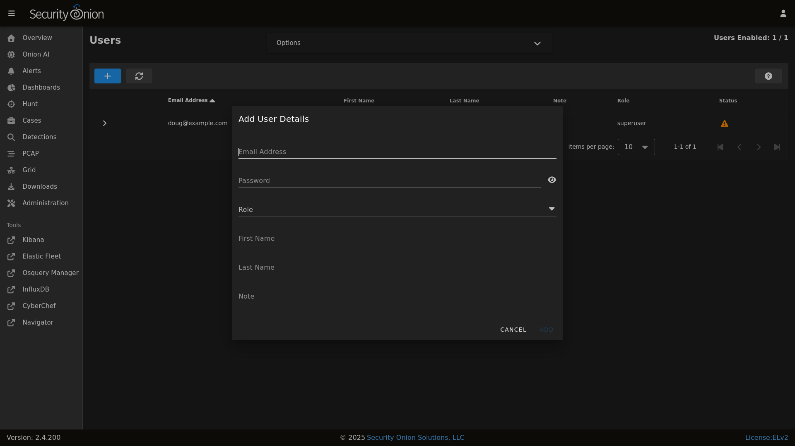

# Adding Accounts

## OS

If you need to add a new OS user account, you can use the `adduser` command.  For example, to add a new account called `tom`:

    sudo adduser tom

!!! TIP
    
    We recommend creating OS usernames in lower case for consistency.

For more information about adding OS user accounts, please see the adduser manual by typing `man adduser`.

## SOC

If you need to add a new account to [SOC](security-onion-console.md), navigate to the [Administration](administration.md) interface, and then click `Users`.

Click the `+` button, fill out the necessary information, and then click the `ADD` button.

!!! TIP
    
    We recommend specifying email addresses in lower case for consistency.

For more information about the Users page, please see the [Administration](administration.md) section.