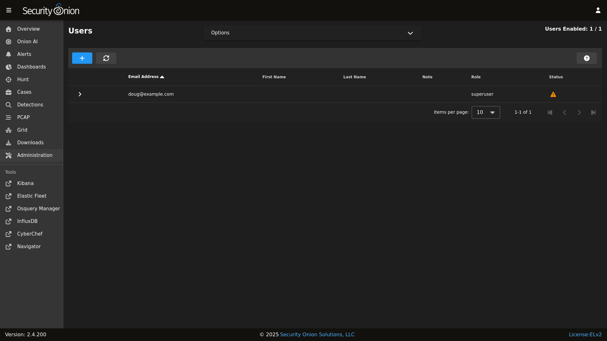
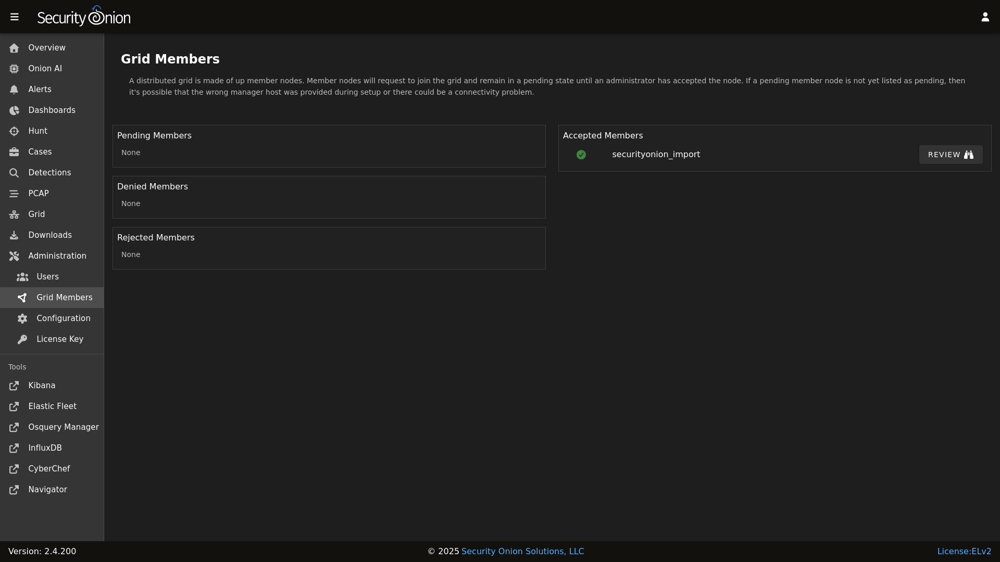
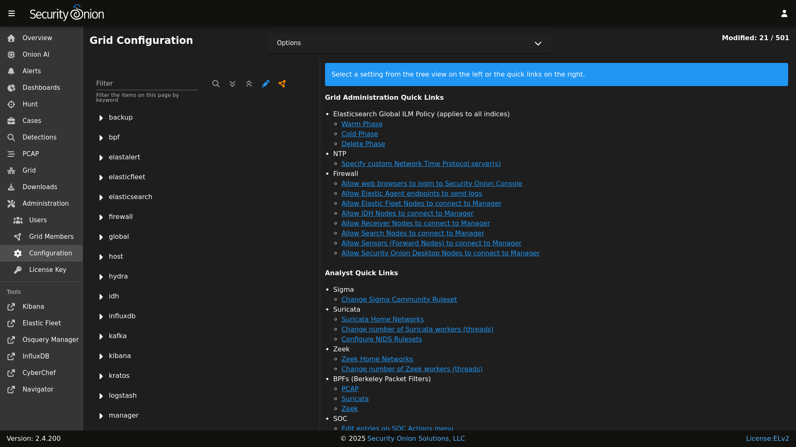
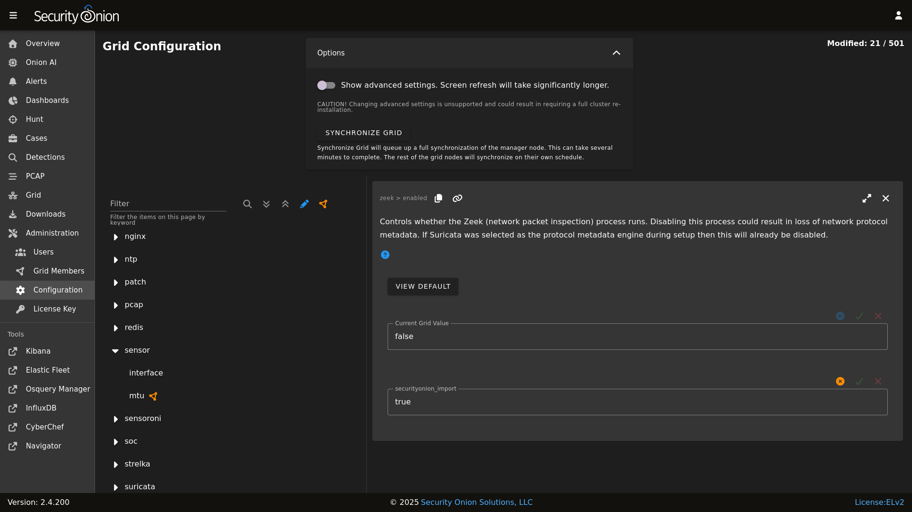
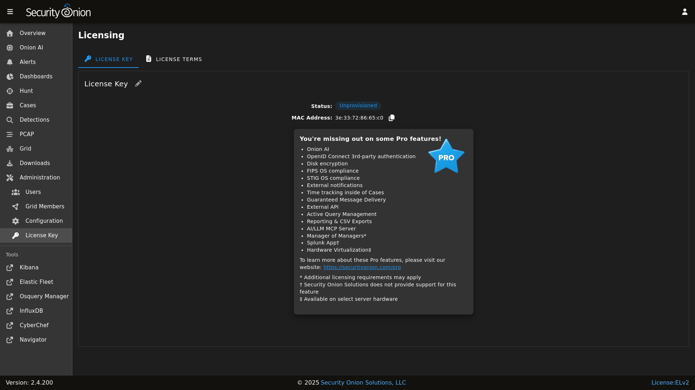

# Administration

[SOC](security-onion-console.md) includes an Administration section which allows you to administer Users, Grid Members, Configuration, and the License Key.

## Users

The Users page shows all user accounts that have been created for the Grid.

The Note column allows administrators to include a short note on a user's account.

The Role column lists roles assigned to the user as defined in the [RBAC](rbac.md) section.

The Status column will show different icons depending on the status of the account:

- orange exclamation point - account enabled but has not yet changed their password and does not have [MFA](mfa.md) enabled
- blue icon with shield - account enabled with [MFA](mfa.md) enabled
- no icon - account enabled and has changed their password but does not have [MFA](mfa.md) enabled
- grey user with slash - account locked
  
Hovering over the icon in the Status column will show you these details as well.

## Grid Members

The Grid Members page shows nodes that have attempted to join the Grid and whether or not they have been accepted into the Grid by an administrator.

Unaccepted members are displayed on the left side and broken into three sections: Pending Members, Denied Members, and Rejected Members. When you accept a member, it will then move to the right side under Accepted Members.

For accepted members, you can click the REVIEW button to show additional information about the Grid member. If you want to remove the member, you can then click the DELETE button and review the confirmation.

## Configuration

The Configuration page allows you to configure various components of your Grid.

The most common configuration options are shown in the quick links on the right side. On the left side, click on a component in the tree view to drill into it and show all available settings for that component. You can then click on a setting to show the current setting or modify it if necessary. If you make a mistake, you can easily revert back to the default value. If a blue question mark appears on the setting page, click it to go to the documentation for that component.

If unsure of which component a particular setting may belong to, use the Filter at the top of the list to look for a particular setting. To the right of the Filter field are buttons that do the following:

- apply the search filter
- expand all settings
- collapse all settings
- show settings that have been modified from the default value
- show settings that have a unique value specified for one or more nodes in the Grid

!!! NOTE
    
    Keys that include `_x_` indicate a placeholder value used to represent a period (`.`).

Some settings can be applied across the entire Grid or to specific nodes. Applying a setting to a specific node will override the Grid setting.

### Advanced Settings

By default, the Configuration page excludes settings that are not intended to be adjusted by most Grid administrators. These advanced settings can cause loss of data and other issues if adjusted incorrectly. To see the advanced settings, go to the Options bar at the top of the page and then click the toggle labeled `Show advanced settings`.

Enabling advanced settings will result in longer load times when viewing the Configuration screen.

!!! WARNING
    
    Changing advanced settings is unsupported and could result in requiring a full cluster re-installation.

### Duplicate Settings

Some settings can be duplicated to more easily create new settings. If a setting is eligible for duplication, then it will have a DUPLICATE button on the right side of the page, provided the `Show advanced settings` option is enabled at the top of the screen. Creating a duplicate setting is a TWO-STEP process.

1. Click the `DUPLICATE` button, provide a name for the new setting, and then click the `CREATE SETTING` button.
2. The new setting will automatically be shown in the Configuration screen. At this point it is not yet saved to the server. The setting's value must be modified explicitly to persist this new setting. Once the value has been modified, click the green checkmark button to save it.

!!! NOTE
    
    Duplicated settings do not retain their original setting's full behavior. For example, if the original setting only allowed for CIDR values, this new setting will not have the same protections on later views in the Configuration screen. Further, duplicated settings are marked as advanced settings. In order to see the new setting at a later time the `Show advanced settings` option must be enabled under the Configuration Options at the top of the Configuration screen. Finally, please note that duplicated settings cannot be removed or renamed via the SOC user interface.

## License Key

The License Key screen allows you to add a license key for [Security Onion Pro](security-onion-pro.md). Once you've added a license key, the screen will show details about your license key.