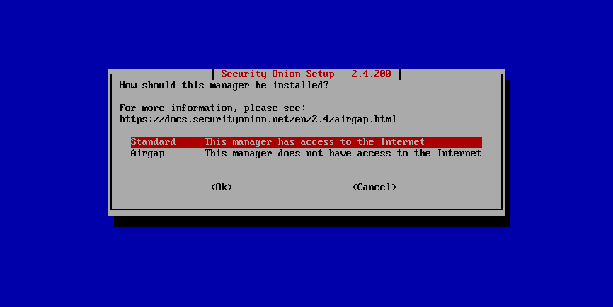

# Airgap

Security Onion is committed to allowing users to run a full install on networks that do not have Internet access. Our ISO image includes everything you need to run without Internet access. Make sure that you choose the airgap option during Setup. 

If your network has Internet access but has overly restrictive proxies, firewalls, or other network devices that might prevent Security Onion from connecting to the sites shown in the [firewall](firewall.md) section, then you may want to consider the airgap option as everything will install from the ISO image itself.

Airgap mode works as follows:

- During the install, all of the necessary RPM packages are copied from the ISO image to a new repo located in `/nsm/repo/`. All devices in the grid will now use this repo for updates to packages.

- [NIDS](nids.md) rules for [Suricata](suricata.md) are copied to `/nsm/rules/suricata`.

- [YARA](yara.md) rules for [Strelka](strelka.md) are copied to `/nsm/rules/yara`.

- [Sigma](sigma.md) rules for [ElastAlert](elastalert.md) are copied to `/nsm/repo/rules/sigma`.

- When updating the system, [soup](soup.md) will ask for the location of the latest ISO media and will then update using that media rather than pulling from the Internet.

## Rule Updates

Our ISO image includes the latest version of various rulesets and will automatically install them when an airgap system is SOUP'ed via ISO:

- [NIDS](nids.md): Emerging Threats (ETOPEN). If you would like to switch to a different ruleset like Emerging Threats Pro (ETPRO), refer to our Ruleset config documentation [NIDS](nids.md)

- [YARA](yara.md): Most recent rules from our repo

- [Sigma](sigma.md): Most recent rule packages from the SigmaHQ repo