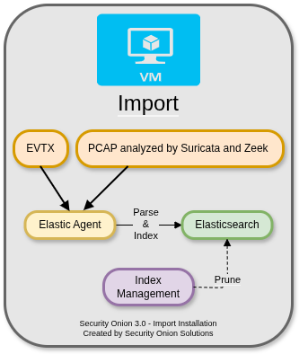
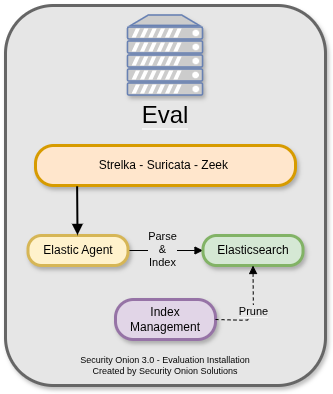
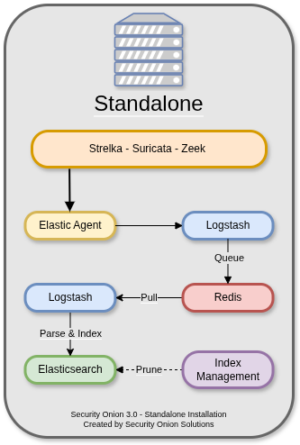
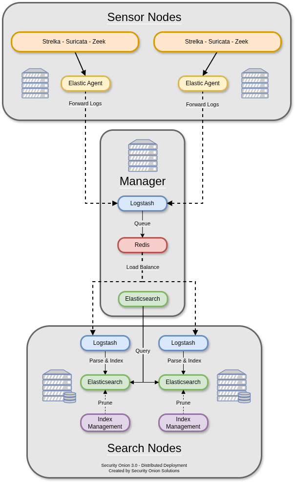
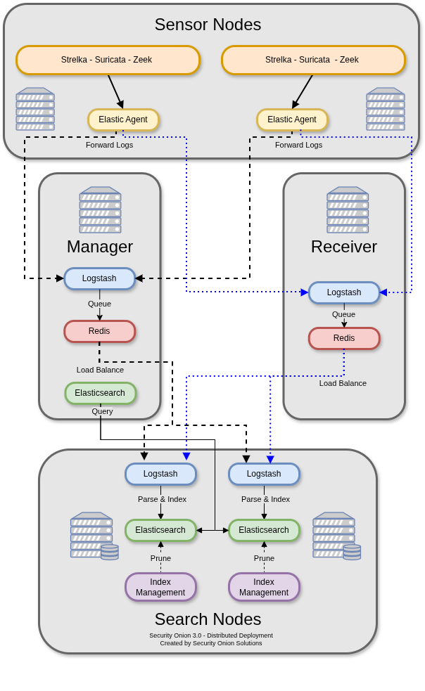
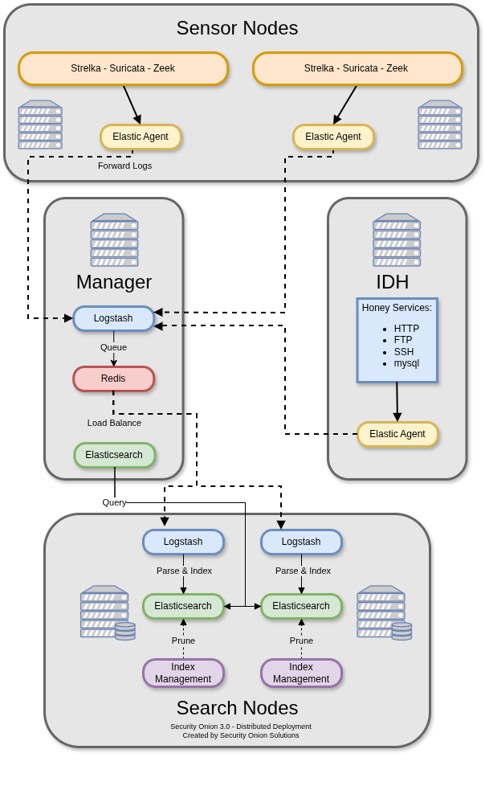
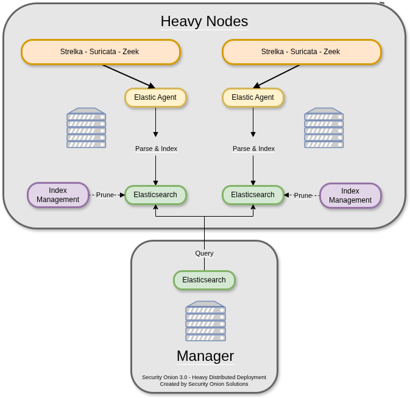

# Architecture

In the [Use Cases](use-cases.md) section, we looked at a few of the most common use cases. This section will discuss what those different use cases look like from an architecture perspective.

## Import

The simplest architecture is an `Import` node. An import node is a single standalone box that runs just enough components to be able to import PCAP or evtx files using the [Grid](grid.md) page. It does **not** support adding Elastic agents or additional Security Onion nodes. For a full walkthrough of the `Import` option, please see the [First Time Users](first-time-users.md) section.

## Evaluation

The next architecture is `Evaluation`. It's a little more complicated than `Import` because it has a network interface dedicated to sniffing live traffic from a TAP or SPAN port. Processes monitor the traffic on that sniffing interface and generate logs. [Elastic Agent](elastic-agent.md) collects those logs and sends them directly to [Elasticsearch](elasticsearch.md) where they are parsed and indexed. Evaluation mode is designed for a quick installation to temporarily test out Security Onion. It is **not** designed for production usage at all and it does not support adding Elastic agents or additional Security Onion nodes.

## Standalone

`Standalone` is similar to `Evaluation` in that all components run on one box. However, instead of [Elastic Agent](elastic-agent.md) sending logs directly to [Elasticsearch](elasticsearch.md), it sends them to [Logstash](logstash.md), which sends them to [Redis](redis.md) for queuing. A second Logstash pipeline pulls the logs out of [Redis](redis.md) and sends them to [Elasticsearch](elasticsearch.md), where they are parsed and indexed.

This type of deployment is typically used for testing, labs, POCs, or **very** low-throughput environments. It's not as scalable as a distributed deployment.

## Security Onion Desktop

The installer includes a [Security Onion Desktop](security-onion-desktop.md) option that builds a simple desktop environment. This environment includes a web browser which allows you to log into an existing Security Onion deployment. It also includes some analyst utilities like [Wireshark](wireshark.md) and [NetworkMiner](networkminer.md).

For more information, please see the [Security Onion Desktop](security-onion-desktop.md) section.

## Distributed

A standard distributed deployment includes a **manager node**, one or more **sensor nodes** running network sensor components, and one or more **search nodes** running Elastic search components. This architecture may cost more upfront, but it provides for greater scalability and performance, as you can simply add more nodes to handle more traffic or log sources.

-  Recommended deployment type
-  Consists of a manager node, one or more sensor nodes, and one or more search nodes

!!! NOTE
    
    If you install a dedicated manager node, you must also deploy one or more search nodes. Otherwise, all logs will queue on the manager and have no place to be stored. If you are limited on the number of nodes you can deploy, you can install a **manager search** node so that your manager node can act as a search node and store those logs. However, please keep in mind that overall performance and scalability of a **manager search** node will be lower compared to our recommended architecture of dedicated manager node and separate search nodes.

## Node Types

### Management

The `manager node` runs [Security Onion Console](security-onion-console.md) and [Kibana](kibana.md). It has its own local instance of [Elasticsearch](elasticsearch.md), but that's mainly used for managing the [Elasticsearch](elasticsearch.md) cluster once search nodes join the cluster. An analyst connects to the manager node from a client workstation (perhaps [Security Onion Desktop](security-onion-desktop.md)) to execute queries and retrieve data. 

Please note that a dedicated manager node requires separate search nodes. Also note that a dedicated manager node has to start off with the `data` node role. When you later join a separate search node, then you may want to migrate the data from the manager to the search node and then remove the `data` node role from the manager. For more information, please see the [Elasticsearch](elasticsearch.md) section.

The manager node runs the following components:

-  [Security Onion Console](security-onion-console.md)
-  [Elasticsearch](elasticsearch.md)
-  [Logstash](logstash.md)
-  [Kibana](kibana.md)
-  [ElastAlert](elastalert.md)
-  [Redis](redis.md)

### Search Node

Search nodes pull logs from the [Redis](redis.md) queue on the manager node and then parse and index those logs. When a user queries the manager node, the manager node then queries the search nodes, and they return search results.

Search Nodes run the following components:

-  [Elasticsearch](elasticsearch.md)
-  [Logstash](logstash.md)

### Manager Search

A `manager search` node is both a manager node and a search node at the same time. Since it is parsing, indexing, and searching data, it has higher hardware requirements than a normal manager node. 

A manager search node runs the following components:

-  [Security Onion Console](security-onion-console.md)
-  [Elasticsearch](elasticsearch.md)
-  [Logstash](logstash.md)
-  [Kibana](kibana.md)
-  [ElastAlert](elastalert.md)
-  [Redis](redis.md)

### Sensor Node

A `sensor node` forwards alerts and logs from [Suricata](suricata.md) and [Zeek](zeek.md) via [Elastic Agent](elastic-agent.md) to [Logstash](logstash.md) on the manager node, where they are stored in [Elasticsearch](elasticsearch.md) on the manager node or a search node (if the manager node has been configured to use a search node). Full packet capture recorded by [Suricata](suricata.md) remains on the sensor node itself.

Sensor nodes run the following components:

-  [Zeek](zeek.md)
-  [Suricata](suricata.md)

### Elastic Fleet Standalone Node

An Elastic Fleet Standalone Node is ideal when there is a large number of Elastic endpoints deployed. It reduces the amount of overhead on the Manager node by transferring the workload associated with managing endpoints to a dedicated system. It is also useful for off-network Elastic Agent endpoints that do not have remote access to the Manager node as it can be deployed to the DMZ and TCP/8220 (Elastic Agent Management network traffic) and TCP/5055 (Elastic Agent log shipping) made accessible to your off-network endpoints.

### Receiver Node

Receiver nodes were designed with 2 purposes in mind:

- reduce the load on the manager
- offer pipeline redundancy

Each receiver node runs [Logstash](logstash.md) and [Redis](redis.md) and allows for events to continue to be processed by search nodes in the event the manager node is offline. When a receiver node joins the Grid, [Elastic Agent](elastic-agent.md) on all nodes adds this new address as a load balanced [Logstash](logstash.md) output. The search nodes add this new node as another [Logstash](logstash.md) input. Receiver nodes are "active-active" and you can add as many as you want (within reason) and events will be balanced among them.

If you don't have any receiver nodes and the manager goes down, the search nodes do not index anything because they cannot connect to [Redis](redis.md). The agents cannot connect to [Logstash](logstash.md) so the pipeline starts backing up on the agents. 

In this same scenario with a receiver node, the agents would not be able to connect to [Logstash](logstash.md) on the manager and so they would try to connect to the receiver node. Once connected, they would send their logs to the receiver. 

Search nodes connect to both the manager and receiver nodes and pull events from the [Redis](redis.md) queue. If the manager goes down, search nodes will keep pulling the log events from the queue on the receiver node. This allows for scaling of the pipeline. More receivers + more search nodes = more event ingestion volume.

If you have a manager or managersearch that is under heavy load due to handling a high volume of events, then system resources can be freed by directing the Elastic Agent to only output events to the receiver node(s) in the environment. Once all configurable and advanced settings are enabled, this feature can be set in SOC Configuration UI under `elasticfleet > enable_manager_output`. Setting this to `False` will prevent the Elastic Agent from sending events to the manager, managersearch, or standalone nodes.

Receiver nodes need to be close to the search nodes because when you add a new receiver node to the Grid, the search nodes add the [Redis](redis.md) service as an input in their configs automatically. If you were to place a receiver node at a remote site, then ALL of your search nodes would be trying to access that [Redis](redis.md) queue remotely. You do not save any bandwidth by placing a receiver node at a remote site.

There are a couple of things to be aware of regarding receiver nodes and Elastic Agents. The first is Fleet which handles things like updating the agents and scheduling searches. The other is the Elastic Agent log output, which in this case is [Logstash](logstash.md) running on the manager or receiver node. Due to limitations in Elastic licensing we can only have a single output policy. That means that when you add a receiver or a fleet node it gets added to a list that is distributed to the agents. The agents go down that list and stop after a successful connection. The only way to direct agents to specific receivers is to use firewall rules to block agents to certain receivers. Again keep in mind that there is no bandwidth savings here because the search nodes still need to empty the [Redis](redis.md) queue on the receiver nodes.

### Intrusion Detection Honeypot (IDH) Node

The [IDH](idh.md) node mimics common services such as HTTP, FTP, and SSH. Any interaction with these fake services will automatically result in an alert.

### Heavy Node

There is also an option to have a **manager node** and one or more **heavy nodes**.

!!! WARNING
    
    Heavy nodes are NOT recommended for most users due to performance reasons, and should only be used for testing purposes or in low-throughput environments.

-  Recommended only if a standard distributed deployment is not possible
-  Consists of a manager node and one or more heavy nodes
-  Each heavy node is an independent Elastic cluster that is queried from the manager via cross-cluster search

!!! NOTE
    
    Heavy nodes do not consume from the [Redis](redis.md) queue on the manager. This means that if you just have a manager and heavy nodes, then the [Redis](redis.md) queue on the manager will grow and never be drained. To avoid this, you have two options. If you are starting a new deployment, you can make your `manager` a `manager search` so that it will drain its own [Redis](redis.md) queue. Alternatively, if you have an existing deployment with a `manager` and want to avoid rebuilding, then you can add a separate search node (NOT heavy node) to consume from the [Redis](redis.md) queue on the manager.

Heavy nodes perform sensor duties and store their own logs in their own local [Elasticsearch](elasticsearch.md) instance. This results in higher hardware requirements and lower performance. Heavy nodes do NOT pull logs from the Redis queue on the manager like search nodes do.

Heavy Nodes run the following components:

-  [Elasticsearch](elasticsearch.md)
-  [Zeek](zeek.md)
-  [Suricata](suricata.md)

There are two instances of Elastic Agent that run on a Heavy Node:  

Instance 1 - Not connected to Fleet (runs standalone), runs in a container, picks up /nsm/ logs and other local logs (SOC) and sends them to the local Heavy Node ES cluster.

Instance 2 - Connected to Grid Fleet Server, runs directly on the Heavy Node. Not currently picking up any logs, but has the Osquery integration installed.
