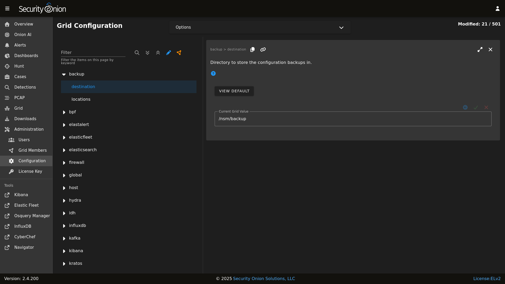

# Backup

Security Onion performs a daily backup of some critical files so that you can recover your grid from a catastophic failure of the manager. Daily backups create a tar file located in the `/nsm/backup/` directory located on the manager. You may want to replicate this backup directory to a location outside of your manager in case the manager ever needs to be rebuilt.

Here is what gets backed up automatically by default:

- `/etc/pki/` - All of the certs including the CA.
- `/etc/salt/` - Configuration for the [salt](salt.md) manager and minions.
- `/nsm/kratos/` - Configuration for [kratos](kratos.md).
- `/nsm/hydra/` - Configuration for Hydra (used for [Connect](connect-api.md)).
- `/opt/so/saltstack/local/` - Customizations done via [Administration](administration.md) --> Configuration. 

If you need to restore one or more files from backup, locate the tar backup file from the desired date and use the standard `tar` command to expand the file. For example, to expand the backup file from March 17, 2025:


```
tar xvf so-config-backup-2025_03_17.tar
```

This will extract the config files from the tar file into subdirectories for `etc`, `nsm`, and `opt`. You can then copy the needed files from those expanded subdirectories to the actual directories.

## Configuration

You can configure backups by going to [Administration](administration.md) --> Configuration --> backup. 



## Elasticsearch

[Elasticsearch](elasticsearch.md) data is not automatically backed up. This includes things that may be important to you like [Kibana](kibana.md) customizations and [Cases](cases.md) data. [Kibana](kibana.md) customizations are located in the `.Kibana` indices and  [Cases](cases.md) data is stored in the `so-case` and `so-casehistory` indices. If you have a distributed deployment with [Elasticsearch](elasticsearch.md) clustering, then you can enable replicas to have redundancy in case of a single node failure. Of course, please keep in mind that enabling replicas doubles your storage needs.

Another option is to use [Elasticsearch](elasticsearch.md)'s built-in support for snapshots:
<https://www.elastic.co/guide/en/elasticsearch/reference/current/snapshot-restore.html>

This option requires that you configure [Elasticsearch](elasticsearch.md) with a `path.repo` setting where it can store the snapshots. Once [Elasticsearch](elasticsearch.md) has the `path.repo` setting, you should be able to log into [Kibana](kibana.md) and configure snapshots as shown in the link above. Those snapshots will then be accessible in `/nsm/elasticsearch/repo/`.