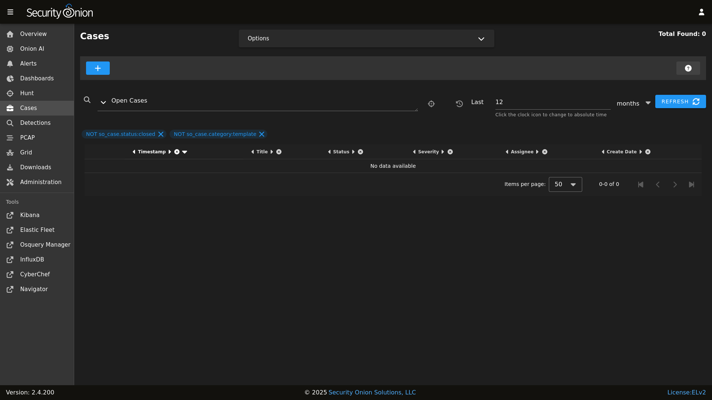
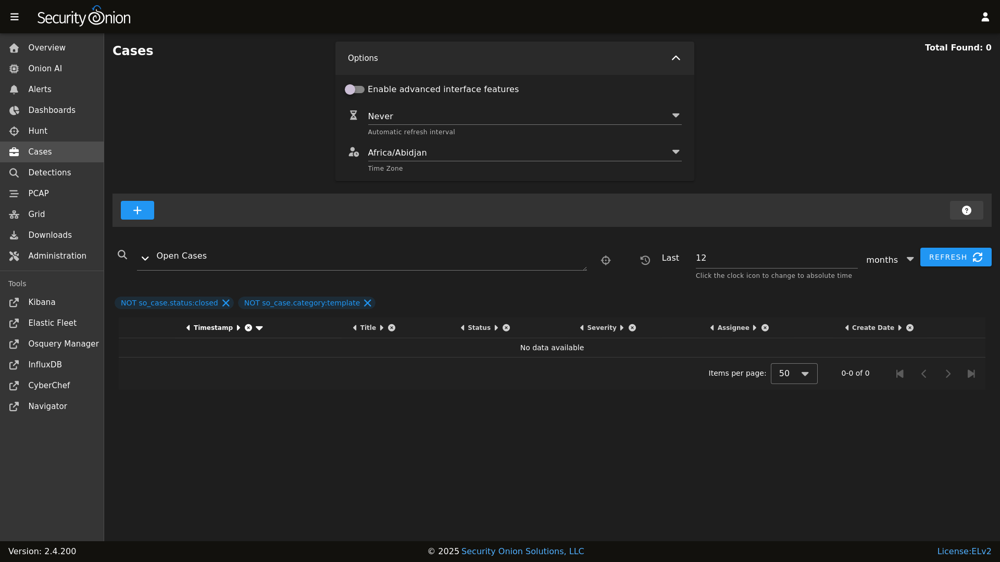
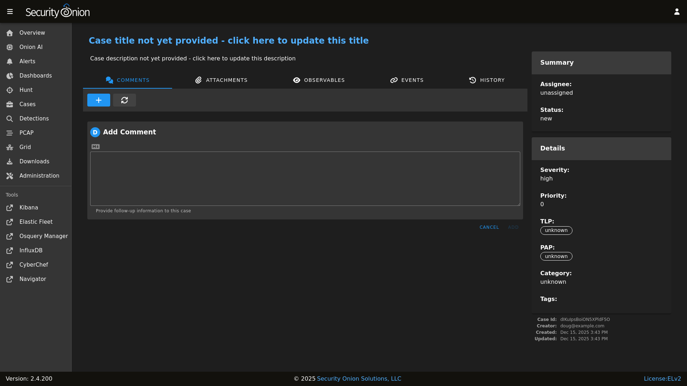
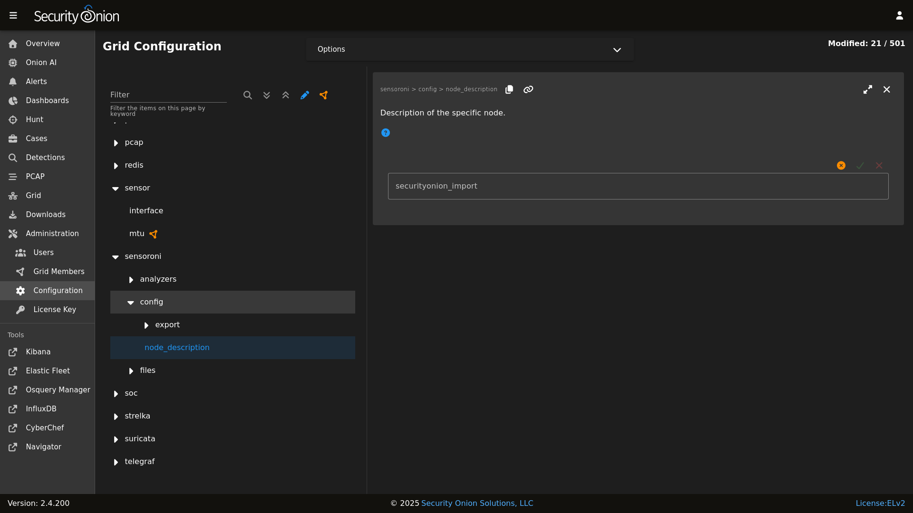

# Cases

[Security Onion Console](security-onion-console.md) includes our Cases interface for case management. It allows you to escalate logs from [Alerts](alerts.md), [Dashboards](dashboards.md), and [Hunt](hunt.md), and then assign analysts, add comments and attachments, and track observables. 

On a new deployment, Cases will be empty until you create a new case. Once you have one or more cases, you can use the main Cases page to get an overview of all cases. 

!!! NOTE
    
    Check out our Cases video at <https://youtu.be/y_kr_hrtqVc>!

## Options

Starting at the top of the main Cases page, the Options menu allows you to set options such as Automatic Refresh Interval and Time Zone.

There is also a toggle labeled `Enable advanced interface features`. If you enable this option, then the interface will show more advanced features similar to [Dashboards](dashboards.md) and [Hunt](hunt.md).

## Query Bar

The query bar defaults to Open Cases. Clicking the drop-down box reveals other options such as Closed Cases, My Open Cases, My Closed Cases, and Templates. If you want to send your current query to Hunt, you can click the crosshairs icon to the right of the query bar.

Under the query bar, you’ll notice colored bubbles that represent the individual components of the query and the fields to group by. If you want to remove part of the query, you can click the X in the corresponding bubble to remove it and run a new search.

If you would like to save your own personal queries, you can bookmark them in your browser. If you would like to customize the default queries for all users, please see the [SOC Customization](security-onion-console-customization.md) section.

## Time Picker

The time picker is to the right of the query bar. By default, Cases searches the last 12 months. If you want to search a different time frame, you can change it here.

## Data Table

The remainder of the main Cases page is a data table that shows a high level overview of the cases matching the current search criteria.

- Clicking the table headers allows you to sort ascending or descending.

- Clicking a value in the table brings up a context menu of actions for that value. This allows you to refine your existing search, start a new search, or even pivot to external sites like Google and VirusTotal.

- You can adjust the Rows per page setting in the bottom right and use the left and right arrow icons to page through the table.

- When you click the arrow to expand a row in the data table, it will show the high level fields from that case. Field names are shown on the left and field values on the right. When looking at the field names, there is an icon to the left that will add that field to the `groupby` section of your query. You can click on values on the right to bring up the context menu to refine your search.

- To the right of the arrow is a binoculars icon. Clicking this will display the full case including the Comments, Attachments, Observables, Events, and History tabs.

## Creating a New Case

To create a new case, click the + icon and then fill out the Title and Description and optionally the fields on the right side including Assignee, Status, Severity, Priority, TLP, PAP, Category, and Tags. Clicking the fields on the right side reveals drop-down boxes with standard options. The Assignee field will only list user accounts that are currently enabled.

Alternatively, if you find events of interest in [Alerts](alerts.md), [Dashboards](dashboards.md), or [Hunt](hunt.md), you can escalate directly to Cases using the escalate button (blue triangle with exclamation point). Clicking the escalate button will escalate the data from the row as it is displayed. This means that if you're looking at an aggregated view, you will get limited details in the resulting escalated case. If you want more details to be included in the case, then first drill into the aggregation and escalate one of the individual items in that aggregation. Once you click the escalate button, you can choose to escalate to a new case or an existing case. 
 
## Comments

On the Comments tab, you can add comments about the case.     The Comments field uses markdown syntax and you can read more about that at <https://www.markdownguide.org/cheat-sheet/>.

If you've enabled [Security Onion Pro](security-onion-pro.md), then when adding a comment you can also specify how many hours you spent working on that activity. You can then see the total time spent by all analysts in the Summary in the upper-right corner.

## Attachments

On the Attachments tab, you can upload attachments. For each attachment, you can optionally define TLP and add tags. Cases will automatically generate SHA256, SHA1, and MD5 hash values for each attachment. Buttons next to the hash values allow you to copy the value or add it as an observable.

## Observables

On the Observables tab, you can track observables like IP addresses, domain names, hashes, etc. You can add observables directly on this tab or you can add them from the Events tab as well.

You can add multiple observables of the same type by selecting the option labeled `Enable this checkbox to have a separate observable added for each line of the provided value above`.

For each observable, you can click the icon on the far left of the row to drill into the observable and see more information about it. To the right of that is the the hunt icon which will start a new hunt for the observable. Clicking the lightning bolt icon will analyze the observable (see the Analyzers section later).

You can also add observables directly from [Alerts](alerts.md), [Dashboards](dashboards.md), or [Hunt](hunt.md). Click the observable and select the `Add to Case` option. You'll then have the option of adding the observable to a new case or an existing case.

## Events

On the Events tab, you can see any events that have been escalated to the case. This could be [Suricata](suricata.md) alerts, network metadata from [Suricata](suricata.md) or [Zeek](zeek.md), or endpoint logs. 

For each event, you can click the icon on the far left of the row to drill in and see all the fields included in that event.

If you find something that you would like to track as an Observable, you can click the eye icon on the far left of the row to add it to the Observables tab. It will attempt to automatically identify well known data types such as IP addresses.

To the right of the eye icon is a Hunt icon that can be used to start a new hunt for that particular value.

## History

On the History tab, you can see the history of the case itself, including any changes made by each user. For each row of history, you can click the icon on the far left of the row to drill in and see more information.

## Data

Cases data is stored in [Elasticsearch](elasticsearch.md). You can view it in [Dashboards](dashboards.md) or [Hunt](hunt.md) by clicking the Options menu and disabling the `Exclude case data` option. You can then search the `so-case` index with the following query:

	_index:"*:so-case"

You can also use this query in [Kibana](kibana.md).

You might want to backup this data as described in the [backup](backup.md) section.

## Analyzers

We have included analyzers which allow you to quickly gather context around an observable.

!!! NOTE
    
    Check out our Analyzers video at <https://youtu.be/99LXr7UmtKI>!

### Supported Analyzers and Data Types

The following is a summary of the built-in analyzers and their supported data types:

| Name | Domain | EML | Hash | IP | Mail | Other | URI | URL | User Agent |
|------|--------|-----|------|----|------|-------|-----|-----|------------|
| Alienvault OTX | ✓ | ✓ | | | | | | | ✓ |
| Echotrail | | | | | ✓ | | | | |
| Elasticsearch | ✓ | ✓ | ✓ | ✓ | ✓ | ✓ | ✓ | ✓ | ✓ |
| EmailRep | | | | ✓ | | | | | |
| Greynoise | | | | ✓ | | | | | |
| LocalFile | ✓ | ✓ | ✓ | | | ✓ | | ✓ | |
| Malwarebazaar | | | ✓ | | | | | | |
| Malware Hash Registry | | | ✓ | | | | | | |
| Pulsedive | ✓ | ✓ | ✓ | | | | ✓ | ✓ | ✓ |
| Spamhaus | | | | ✓ | | | | | |
| Sublime Platform | | ✓ | | | | | | | |
| Threatfox | ✓ | ✓ | ✓ | | | | | | |
| Urlhaus | | | | | | | | | ✓ |
| Urlscan | | | | | | | | | ✓ |
| Virustotal | ✓ | ✓ | ✓ | | | | | ✓ | |
| WhoisLookup | ✓ | | | | | | | | |

!!! NOTE
    
    The `malwarehashregistry` analyzer is no longer working as of 2.4.100. This is due to a stale third-party library that is incompatible with the latest Python version. See [#13571](https://github.com/Security-Onion-Solutions/securityonion/issues/13571)

### Running Analyzers

To enqueue an analyzer job, click the lightning bolt icon on the left side of the observable menu. All configured analyzers supporting the observable's data type will then run and return their analysis.

!!! NOTE
    Observable values must be formatted to correctly match the observable type in order for analyzers to properly execute against them. For example, an IP observable type should not contain more than one IP address.

### Analyzer Output

The collapsed job view for an analyzer will return a summary view of the analysis. Expanding the collapsed row will reveal a more detailed view of the analysis.

!!! WARNING
    
    If you try to run the Malware Hash Registry analyzer but it results in a "Name or service not known" error, then it may be a DNS issue. Folks using 8.8.4.4 or 8.8.8.8 as their DNS resolver have reported this issue. A potential workaround is to switch to another DNS resolver like 1.1.1.1.

### Configuring Analyzers

Some analyzers require authentication or other details to be configured before use. If analysis is requested for an observable and an analyzer supports that observable type but the analyzer is left unconfigured, then it will not run.

The following analyzers require users to configure authentication or other parameters in order for the analyzer to work correctly:

- AlienVault OTX
- Echotrail
- Elasticsearch
- EmailRep
- GreyNoise
- LocalFile
- Malwarebazaar
- Pulsedive
- Threatfox
- Urlscan
- VirusTotal

To configure an analyzer, navigate to [Administration](administration.md) --> Configuration --> sensoroni.

At the top of the page, click the `Options` menu and then enable the `Show advanced settings` option. Then navigate to sensoroni --> analyzers.

### Developing Analyzers

If you'd like to develop a custom analyzer, take a look at the developer's guide at <https://github.com/Security-Onion-Solutions/securityonion/tree/2.4/main/salt/sensoroni/files/analyzers>.

## Templates

SOC can use case templates to auto-populate default values of new cases. A template is itself a case, with its category set to `template`. To utilize that template case, the new case should specify the template case ID in the `template` field of the case object.

SOC automatically populates new case template fields with the value stored in the `rule.case_template` field of the alert being escalated. This allows for specific templates to be assigned to certain detection rules. For example, if alerts triggered from a certain rule are known to require a consistent set of resolution steps then the description of a case template can be prepopulated with that checklist (in markdown format). Then, the backing rule that triggered the alert can have its `case_template` field set to that case template ID.
