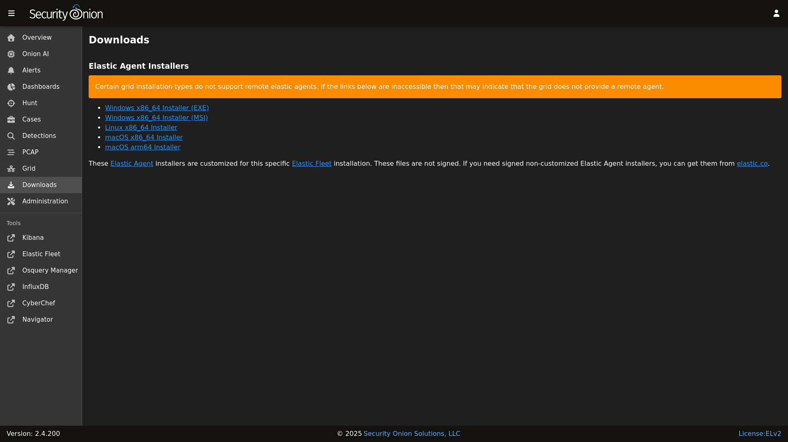

# Downloads

[SOC](security-onion-console.md) includes a Downloads interface that allows you to download the [Elastic Agent](elastic-agent.md) for various operating systems.

!!! WARNING
    
    Please note that Evaluation installs and Import installs do not support remote Elastic agents, so in those cases the links are shown for demonstration purposes only.

!!! NOTE
    
    When installing the Elastic Agent onto remote systems, be sure to allow network access through the [Firewall](firewall.md).