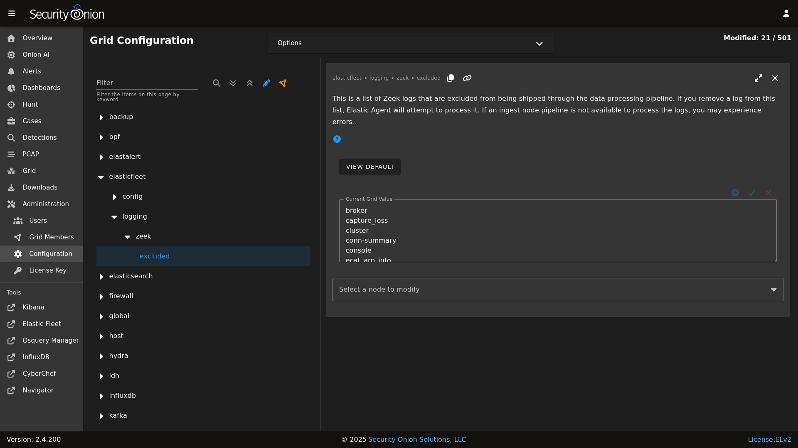

# Elastic Fleet

[SOC](security-onion-console.md) includes a link on the sidebar that takes you to the Fleet page inside [Kibana](kibana.md).

Elastic Fleet is pre-configured during Security Onion setup. If you need to make changes to the configuration, you can do so via the Fleet page in [Kibana](kibana.md) as detailed below.

The Fleet page has multiple tabs across the top: Agents, Agent policies, Enrollment tokens, Uninstall tokens, Data streams, and Settings. Each of these tabs is described below.

## Agents

The Agents tab displays registered Elastic agents.

To view agent details, click the `Host` name. 

To assign the agent to a new policy, unenroll, upgrade the agent, or perform other actions, click the `Actions` menu on the right side of the agent listing and select the appropriate option.

By default, Elastic Agent is installed on every Security Onion Grid node. As a result, all Grid node agents will be enrolled in the `SO-Grid-Nodes` agent policy. 

!!! WARNING
    
    We do not recommend removing policy settings for Security Onion Grid node agents.

### Adding Agents

To add a new agent to your deployment, see the [Elastic Agent](elastic-agent.md) section.

### Upgrading Agents

Fleet automatically checks to see if agents are the latest version. If not, agents will display `Upgrade available`. If you would like to upgrade an agent, click the `Actions` menu on the right side and select the `Upgrade agent` option. You will then have the opportunity to select which version to upgrade to. Please choose the version number that matches the version of the Elastic stack that you are currently running. For example, if you are currently running Elastic 8.18.4 then you should select the 8.18.4 agent version.

!!! WARNING
    
    If you try to upgrade to a version of the agent that is newer than the version of your Elastic stack, then you may run into errors. For example, if you are currently running Elastic 8.18.4 and try to upgrade to agent version 8.19.0 or 9.1.0 then you may run into errors.

### Monitoring Agents

Agent health can be monitored in Elastic Fleet under the Agents tab, however you may want to generate alerts when an Agent reports a degraded or offline state. Via [Administration](administration.md) --> Configuration --> manager -> agent_monitoring you can enable a script that will periodically poll Elastic Fleet. Agents in an offline or degraded state for longer than the configured threshold (default is 5h) will generate an Alert in the [Alerts](alerts.md) interface of SOC.

For more granular control over what Agents generate an alert, you can leverage fleet 'tags' to tag those agents. Then under [Administration](administration.md) --> Configuration --> manager -> agent_monitoring -> config -> custom_kquery you can enter a kql search like `tags: critical`. Then only those Agents tagged as 'critical' would generate an Alert.

For more information on Elastic Fleet tags see <https://www.elastic.co/docs/reference/fleet/filter-agent-list-by-tags#add-tags-in-fleet>.

!!! TIP
    Security Onion Pro users can configure external [notifications](notifications.md).

## Agent Policies

Agent policies dictate what data each agent will ingest and forward to Elasticsearch. This could be through the use of an HTTP, log file, or TCP-based input.

The individual components within each agent policy are called integrations (referred to as `package policies` at the API level), and refer to a specific input and settings pertinent to a data source.

For example, the `SO-Grid-Nodes` agent policy is comprised of the following integrations:

- Elasticsearch-logs (`Elasticsearch` integration)
- import-evtx-logs (`Custom Logs` integration)
- import-Suricata-logs (`Custom Logs` integration)
- import-Zeek-logs (`Custom Logs` integration)
- kratos-logs (`Custom Logs` integration)
- Osquery-Grid-nodes (`Osquery Manager` integration)
- Redis-logs (`Redis` integration)
- Strelka-logs (`Custom Logs` integration)
- Suricata-logs (`Custom Logs` integration)
- syslog-tcp-514 (`Custom Logs` integration)
- syslog-udp-514 (`Custom Logs` integration)
- system-Grid-nodes (`System` integration)
- Zeek-logs (`Custom Logs` integration)

## Agent Policies - endpoints-initial

Agent installers downloaded from [Downloads](downloads.md) are deployed using the `endpoints-initial` Agent Policy. This policy includes the `Elastic Defend`, `Osquery Manager`, `System`, and `Windows` integrations.

### elastic-defend-endpoints (`Elastic Defend` integration)

The `Elastic Defend` integration has both free and paid features. By default, only the following free features are enabled:

- Event Collection - Windows

  - Credential Access
  - DLL and Driver Load
  - DNS
  - File
  - Network
  - Process
  - Registry
  - Security

- Event Collection - macOS

  - DNS
  - File
  - Process
  - Network

- Event Collection - Linux

  - File
  - Network
  - Process

!!! TIP
    
    If you are upgrading from 2.4.160 or earlier you will need to manually enable the 'DNS' event collection feature for macOS found under the 'endpoints-initial' policy.

### Osquery-endpoints (`Osquery Manager` integration)

The `Osquery Manager` integration runs Osquery as a daemon on the endpoint and makes the endpoint available for Live or Scheduled queries through the Osquery manager interface in Kibana.

### system-endpoints (`System` integration)

The `System` integration collects the following logs from the endpoint, where applicable:

- System auth logs

    - `/var/log/auth.log*`
    - `/var/log/secure*`

- Syslog logs

    - `/var/log/messages*`
    - `/var/log/syslog*`
    - `/var/log/system*`

- Windows Event Log - Application channel
- Windows Event Log - Security channel
- Windows Event Log - System channel

### windows-endpoints (`Windows` integration)

The `Windows` integration collects the following logs from the endpoint, where applicable:

- Windows Event Log:

  - ForwardedEvents channel
  - Windows Powershell channel
  - Microsoft-Windows-Powershell/Operational channel
  - Microsoft-Windows-Sysmon/Operational channel

## Enrollment Tokens

An enrollment token allows an agent to enroll in Fleet, subscribe to a particular agent policy, and send data.

Each agent policy typically uses its own enrollment token. It is recommended that these tokens are NOT to be changed, especially those generated by default Security Onion agent policies.

## Data Streams

Data collected by Elastic Agent is sent to a [data stream](https://www.elastic.co/guide/en/fleet/current/fleet-overview.html#data-streams-intro) by default. This allows data to be efficiently categorized and managed across a variety of datasets. This section within the Fleet UI allows for a quick review of data streams generated by data from Elastic Agent.

## Settings

The section provides details such as:

- Fleet server hosts in your deployment
- Configured outputs

  - specifies where data will be sent
  - this should include Elasticseach for the Fleet server and Logstash for Elastic Agent
  
- Method in which agent binaries will be downloaded

  - this will be a local artifact repository if running an airgapped deployment

!!! WARNING
    
    We do NOT recommend changing these settings, as they are managed by Security Onion.

If you want more granular control over which Fleet Server an Agent will send logs to, there are two options:

- The first option is to use firewall rules to only allow certain agents. Suppose you have two Fleet Server Nodes, one at 192.168.55.25 and the other at 192.168.58.25. If you want your endpoints in the 192.168.58.0/24 subnet to only connect to the Fleet server at 192.168.58.25, you would add custom firewall rules via [Administration](administration.md) --> Configuration --> firewall --> hostgroups --> elastic_agent_endpoint. Select the 192.168.58.25 Fleet Node and add `192.168.58.0/24`. Endpoints in that subnet will still attempt to connect to the Fleet Server Node at 192.168.55.25, but since it is not accessible (no firewall rules that enable communication), they will connect to the Fleet Node at 192.168.58.25.

- The second option is to purchase an Elastic license. A paid Elastic license offers the ability to customize different Outputs per Agent Policy.

## Integrations

Elastic Fleet supports integrations and you can read more in the [third-party-integrations](third-party-integrations.md) section.

## Custom FQDN URL

You can add custom FQDN for Agents to connect to (for both control traffic on port TCP/8220 and data traffic on port TCP/5055) by editing the config as follows.

First, go to [Administration](administration.md) --> Configuration --> elasticfleet.

At the top of the page, click the `Options` menu and then enable the `Show advanced settings` option. Then, navigate to elasticfleet --> config --> server --> custom_fqdn and set your custom FQDN. Within 15 minutes, the grid will apply these new settings and you should see the new FQDNs show up in Elastic Fleet settings. New agent installers will also be regenerated to use this new setting.

## More Information

!!! NOTE
    
    For more information about Fleet, please see <https://www.elastic.co/guide/en/kibana/current/fleet.html>.