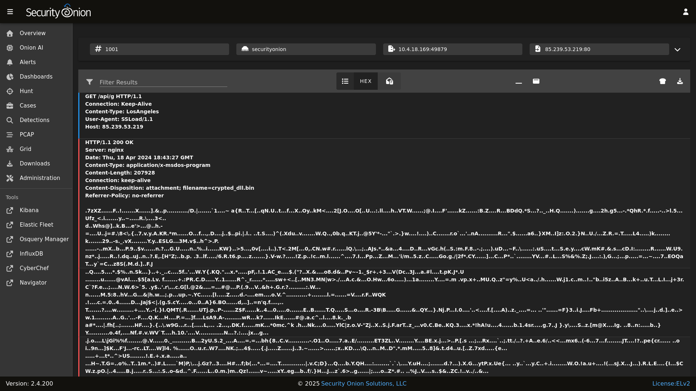
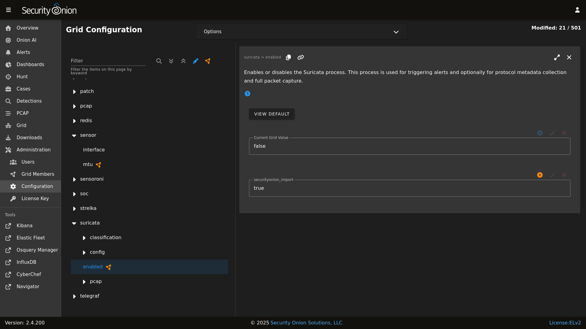

# Full Packet Capture

Security Onion writes network traffic to disk for full packet capture using [Suricata](suricata.md). 

Suricata writes standard PCAP files which can be copied off to another system and then opened with any standard libpcap tool.

## Analysis

You can access full packet capture via the [PCAP](pcap.md) interface:



[Alerts](alerts.md), [Dashboards](dashboards.md), and [Hunt](hunt.md) allow you to easily pivot to the [PCAP](pcap.md) interface.

## Configuration

You can configure full packet capture by going to [Administration](administration.md) --> Configuration --> Suricata --> config --> pcap.



### Conditional PCAP

By default, Suricata writes all network traffic to PCAP. If you would like to limit Suricata to only writing PCAP when certain conditions are met, you can go to [Administration](administration.md) --> Configuration --> Suricata -> config -> pcap -> conditional and change it to to either `alerts` or `tag`:

- `all`: Capture all packets seen by Suricata (default).
- `alerts`: Capture only packets associated with a [NIDS](nids.md) alert.
- `tag`: Capture packets based on a rule that is tagged.

### PCAP Configuration Options

Here are some other PCAP configuration options that can be found at [Administration](administration.md) --> Configuration --> Suricata -> config -> pcap. Some settings are considered advanced settings so you will only see them if you enable the `Show advanced settings` option.

- `compression`: Set to `none` to disable compression. Set to `lz4` to enable lz4 compression but note that this requires more CPU cycles.
- `lz4-level`: lz4 compression level of PCAP files. Set to `0` for no compression. Set to `16` for maximum compression.
- `maxsize`: Maximum size in GB for total disk usage of all PCAP files written by Suricata. If you originally installed version 2.4.60 or newer, then this value should have been set based on a percentage of your disk space. If you originally installed a version older than 2.4.60, then this value should have been set to `25` by default. You may need to adjust this value based on your disk space and desired PCAP retention.
- `filesize`: Maximum file size for individual PCAP files written by Suricata. Increasing this number could improve write performance at the expense of PCAP retrieval time.
- `use-stream-depth`: Set to `no` to ignore the stream depth and capture the entire flow. Set to `yes` to truncate the flow based on the stream depth.

## VLAN Tags

If your network traffic has VLAN tags, then Suricata will log them. For more information, please see the [Suricata](suricata.md) section.

## Diagnostic Logging

Diagnostic logging for Suricata can be found at `/opt/so/log/suricata/suricata.log`. Depending on what you're looking for, you may also need to look at the [Docker](docker.md) logs for the container:

```
sudo docker logs so-suricata
```
