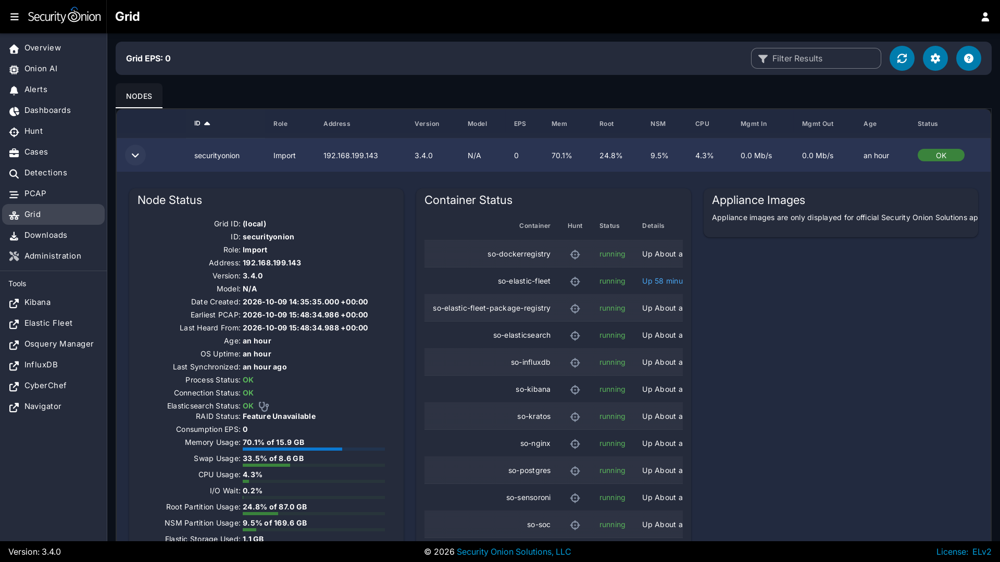
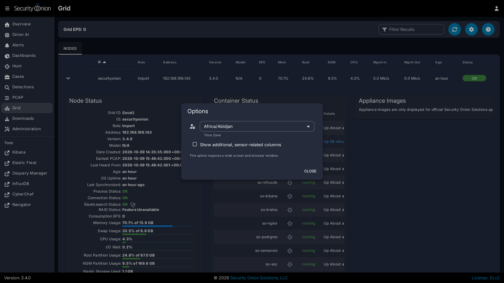
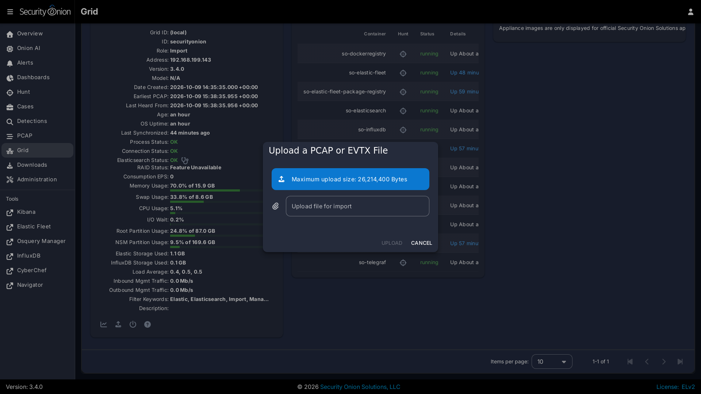

# Grid

[Security Onion Console](security-onion-console.md) includes a grid interface which allows you to quickly check the status of all nodes in your grid.

Starting at the top of the page, there is a `Grid EPS` value in the upper-right corner that shows the sum of all `Consumption EPS` measurements in the entire Grid. Below that you will find a list of all nodes in your grid.

!!! WARNING
    
    Please note that new nodes start off showing a red `Fault` and may take a few minutes to fully initialize before they show a green OK.

!!! NOTE
    
    The `EPS` column represents Events Per Second consumed, so it will only be relevant on nodes that ingest data. Pure sensors do not ingest events, so those nodes will show 0 EPS. If you want to identify sensors that are generating large volumes of events, you can sort by the `Mgmt Out` column, which shows the outbound traffic throughput on the management network interface.

The options dropdown near the top of the page includes a checkbox which will show additional sensor-related columns in the table. You can use these sortable columns to help identify sensors that may be underperforming or due for a hardware upgrade. As these additional columns take up significant screen area, they will only be visible on wide displays where the Security Onion Console web browser window is wide enough to show a large number of tabular columns.

You can drill into individual nodes to see detailed information including Node Status, Container Status, and Appliance Images.

## Node Status

The `Node Status` section displays many different fields relating to each node's status.

!!! NOTE
    
    If a node has not checked in recently then the metrics and statuses for that node will be slightly grayed out, to indicate that the values are stale.

### ID

The `ID` field shows the hostname assigned to the node.

### Role

The `Role` field shows the type of Security Onion node that was selected during Security Onion setup.

### Address

The `Address` field shows the network IP address assigned to the management interface of the node.

### Version

The `Version` field shows the version of Security Onion installed on this node.

### Model

The `Model` field shows the official Security Onion Solutions appliance model number. For non-SOS devices, this field will show `N/A`.

### Date Created

The `Date Created` field shows the date the node was created. This date is based on the node's filesystem timestamps, so replacing partition data or manually recreating core areas of the filesystem can interfere with assessing a node's true age.

### Earliest PCAP

The `Earliest PCAP` field shows the earliest PCAP that is available on a sensor node and is only visible on sensor nodes which capture live packet data.

### Last Heard From

The `Last Heard From` field shows the last time that the node checked-in with the manager. Note that a check-in doesn't always include updated node metrics. 

### Age

The `Age` field shows how long the node has been part of the grid and is based on the `Date Created` value.

### OS Uptime

The `OS Uptime` field shows how long the node has been running since the last power-on or reboot event.

If the node needs to be restarted to apply kernel updates then a message will appear next to the uptime value indicating this. The reboot button at the bottom of the Grid page allows administrators to remotely reboot a node via the Security Onion Console web interface.

### Last Synchronized

The `Last Synchronized` field shows how long ago the node was synchronized to the manager node. This is equivalent to the last Salt highstate run. Knowing this value can be helpful when making configuration changes to the grid and determining whether a specific node has received those changes.

### Process Status

If the `Process Status` field shows `Fault`, you can check the other status indicators as well as the `Container Status` section to determine which process has failed.

### Connection Status

The `Connection Status` field shows whether or not the node is currently connected to the grid.

### Elasticsearch Status

If the node runs [Elasticsearch](elasticsearch.md), then the `Elasticsearch Status` field will show the status of it. If the status is anything other than OK, then see the [Elasticsearch](elasticsearch.md) section to troubleshoot.

### RAID Status

If you are using an official Security Onion Solutions appliance with RAID support, then you will see the corresponding status appear in this field.

### Consumption EPS

The `Consumption EPS` field is the number of Events Per Second consumed.

### Memory Usage

The `Memory Usage` field shows the system memory percentage used, as well as the total memory, in gigabytes. If this value is consistently in the red, then it may be time to add more system memory. Consistently red usage will likely end up causing node faults due to some services being automatically shutdown to recover memory for more critical processes.

### Swap Usage

The `Swap Usage` field shows the system swap percentage used, as well as the total swap, in gigabytes. Systems that do not have swap enabled will remain at 0.0%. If this value is consistently in the red, then it may be time to increase the system memory and potentially the swap size.

### CPU Usage

The `CPU Usage` field shows the system CPU percentage used, across all cores. If this value is consistently in the red, then it may be time to upgrade the node hardware or distribute the load across additional nodes.

### I/O Wait

The `I/O Wait` field shows the system I/O wait percentage. Higher values indicate the system is spending more time waiting for network or disk data transfer. If this value is consistently in the red, then it may be time to replace slow disks or expand network throughput capacity.

### Capture Loss

The `Capture Loss` field shows the percentage of packet capture loss reported by [Zeek](zeek.md). Higher values indicate a reduced visibility into packets traversing the network. If [Zeek](zeek.md) is reporting capture loss but no packet loss, this usually means that the capture loss is happening upstream in the TAP or SPAN port itself.

### Zeek Loss

The `Zeek Loss` field shows the percentage of dropped packets due to [Zeek](zeek.md) being unable to keep up with the flow of network data. 

### Suricata Loss

The `Suricata Loss` field shows the percentage of dropped packets due to [Suricata](suricata.md) being unable to keep up with the flow of network data.

### Root Partition Usage

The `Root Partition Usage` field shows the percentage of the root OS disk utilization, as well as the total capacity of that disk (or partition). If this value is consistently in the red, then it can lead to problems including being unable to upgrade OS packages and Security Onion, the inability to save system logs, and other critical issues.

### NSM Partition Usage

The `NSM Partition Usage` field shows the percentage of the NSM disk utilization, as well as the total capacity of that disk (or partition). If this value is consistently in the red, then it can lead to problems including being unable to ingest new events, store PCAP on disk, detect anomalous events, and other critical issues.

### Elastic Storage Used

The `Elastic Storage Used` field shows the total gigabytes used by [Elasticsearch](elasticsearch.md) to store the ingested events, across all indices.

### InfluxDB Storage Used

The `InfluxDB Storage Used` field shows the total gigabytes used by [InfluxDB](influxdb.md) to store the current and historic metric data collected from all nodes in the grid.

### PCAP Retention

The `PCAP Retention` field shows the number of historic days of available packet capture data which can be viewed by analysts using the Security Onion Console [PCAP](pcap.md) tool.

### Load Average

The `Load Average` field shows the 1 minute, 5 minute, and 15 minute load averages for the node. Note that on systems with high numbers of CPU cores, this average can be equally as high. For example, if a system has 128 cores then a load average of 128 generally indicates that all 128 cores are working at the peak capacity. Exceeding that number can indicate that some cores are bottlenecked due to waiting on I/O. 

### Redis Queue Size

The `Redis Queue Size` field shows the number of events queued in [Redis](redis.md) waiting to be ingested into [Elasticsearch](elasticsearch.md). If this number is either steady or falling then it indicates the system is able to keep up with the current traffic flow. If this number is continually increasing then it can indicate a problem with ingest times taking too long for the amount of events that are being generated. Occasional increases are expected during traffic bursts but should eventually start to decrease once the high traffic flow period ends.

### Inbound Monitor Traffic

The `Inbound Monitor Traffic` field shows the throughput of inbound bytes reaching the sensor's monitoring interface.

### Dropped Monitor Traffic

The `Dropped Monitor Traffic` field shows the throughput of inbound bytes intended for the sensor's monitoring interface but are instead dropped, typically due to insufficient network capacity.

### Inbound Mgmt Traffic

The `Inbound Mgmt Traffic` field shows the throughput of inbound bytes intended for the node's management interface. This is the internal interface that the node uses to communicate with other nodes in the Security Onion Grid.

### Outbound Mgmt Traffic

The `Outbound Mgmt Traffic` field shows the throughput of outbound bytes being transmitted from the node's management interface. This is the internal interface that the node uses to communicate with other nodes in the Security Onion Grid.

### Filter Keywords

The `Filter Keywords` fields shows the list of keywords that are associated with this node type. These keywords are useful for filtering to only show nodes of a certain type.

### Description

The `Description` field shows the optional description you may have entered during Setup or set in [Administration](administration.md) --> Configuration --> sensoroni --> config --> node_description.

### Icons in Lower Left Corner

There are a few icons in the lower left of the `Node Status` section depending on what kind of node you are looking at: 

- Clicking the chart icon takes you directly to the [Metrics](#metrics) tab filtered to that particular node (or the [InfluxDB](influxdb.md) dashboard on older configurations), allowing you to view historic health metrics and trends.

- If the node is a network sensor, then there will be an additional icon for sending test traffic to the sensor.

- Depending on the node type, there may be an additional icon for uploading your own PCAP or EVTX file. Clicking this icon results in an upload form. Once you've selected a file and initiated the upload, a status message appears. Uploaded PCAP files are automatically imported via [so-import-pcap](so-import-pcap.md) and EVTX files are automatically imported via [so-import-evtx](so-import-evtx.md). Once the import is complete, a message will appear containing a hyperlink to view the logs from the import. Please note that import is not supported on heavy nodes. Also note that this import method is designed for smaller files. If you need to import files larger than the default max upload size then you will need to either change the max upload size via the Configuration screen, or manually import via [so-import-pcap](so-import-pcap.md) or [so-import-evtx](so-import-evtx.md).

- The reboot button allows for remotely rebooting a grid node. This may be necessary when scheduled OS/kernel updates are automatically applied and require a restart to take effect. Review the notes on the confirmation dialog thoroughly before confirming a reboot. Rebooting a manager node will likely cause the Security Onion Console web interface to become temporarily unavailable.

- Clicking the question mark button takes you to this help document.

## Container Status

!!! NOTE
    
    Restarting a node can take several minutes for all containers to return to a running state.

If any containers show anything other than `running` click the cross-hair icon next to the container name. This will bring up the Hunt screen showing logs specific to that container, and may help determine why the container is not running.

## Appliance Images

If a node is running on an official Security Onion Solutions appliance then the Grid page will show pictures of the front and rear of the appliance. This is useful for walking through connectivity discussions with personnel in the data center. When not using official Security Onion Solutions appliances it will simply display a message to that effect.

## Metrics

The **Metrics** tab on the Grid interface provides native, interactive time-series performance and health monitoring across all nodes and containers in your Security Onion grid. Built directly into the Security Onion Console (SOC) with integrated historical metrics storage, the Metrics system provides a unified dashboard experience.

### Prerequisites

For the **Metrics** tab and historical performance graphs to appear on the user interface:

1. **Telegraf Output Configuration (`telegraf.output`)**: The `telegraf.output` configuration parameter (located under **Administration** --> **Configuration** --> **telegraf** --> **output**) must be set to either `POSTGRES` or `BOTH` for metrics to be enabled. This enables historical metrics graphing on the grid and sets `historicalMetricsEnabled: true` on reporting nodes.
2. **User Authorization**: To view historical metrics, the logged-in user must hold the *View all nodes in Grid* permission (`grid/read` or `nodes/read`). This permission is included by default in the `superuser`, `analyst`, `limited-analyst`, `auditor`, and `limited-auditor` roles.

If historical metrics are not enabled on any node in the grid (e.g., `telegraf.output` is set to `INFLUXDB`), the **Metrics** tab remains hidden on the top navigation bar of the Grid screen.

### Metrics Dashboard & Graphs

When viewing the **Metrics** tab, Security Onion displays a responsive dashboard containing up to **26 distinct metric panels** covering operating system resources, ingest pipelines, detection engines, Docker containers, and messaging queues:

| Category | Panel Title | Metric Key | Description |
|---|---|---|---|
| **Host OS & System** | **CPU Usage** | `cpu` | Percentage of CPU utilized across all cores (`cpu_used`), tracking active workload versus idle time. |
| | **Memory Usage** | `memory` | System RAM utilization percentage (`memory_used`). |
| | **Load Average** | `load` | System load averages over 1-minute (`load1`), 5-minute (`load5`), and 15-minute (`load15`) intervals. |
| | **Swap Usage** | `swap` | System swap space utilization percentage (`swap_used`). |
| | **I/O Wait** | `io_wait` | Percentage of CPU time spent waiting for outstanding disk or network I/O requests (`io_wait`). |
| | **System Uptime** | `system_uptime` | Total operating system uptime in days and seconds (`system_uptime`). |
| | **Disk Usage** | `disk` | Partition utilization percentage for the root OS filesystem (`/`) and the NSM data partition (`/nsm`). |
| | **Network Traffic** | `net` | Throughput in bits per second for Management In (`traffic_man_in`), Management Out (`traffic_man_out`), and Monitor In (`traffic_mon_in`). |
| | **Monitor Packet Drops** | `net_drops` | Packet drops observed on monitoring capture interfaces (`traffic_mon_drops`). |
| | **PCAP Retention** | `pcap_retention` | Age and retention window of packet capture buffers stored on disk in days (`pcap_retention`). |
| **Pipeline & Ingestion** | **Grid / Consumption EPS** | `eps` | Events per second consumed across ingest components (`consumption_eps`). |
| | **Logstash EPS** | `logstash_eps` | Inbound event throughput received by Logstash pipelines (`logstash_eps`). |
| | **Elasticsearch Storage Size** | `elasticsearch_size` | Total disk storage consumed by Elasticsearch indices (`elasticsearch_size`). |
| | **Elasticsearch Document Count** | `elasticsearch_docs` | Total number of indexed documents across all Elasticsearch indices (`elasticsearch_docs`). |
| | **Elasticsearch Ingest Time** | `elastic_ingest_time` | Average document indexing latency in milliseconds (`elastic_ingest_time`). |
| | **Redis Queue Size** | `redis_queue` | Number of unparsed events queued in Redis awaiting pipeline processing (`redis_queue`). |
| **Detection Engines** | **Packet Loss** | `loss` | Packet drop rates reported by Suricata (`suricata_loss`) and Zeek (`zeek_loss`). |
| | **Zeek Capture Loss** | `capture_loss` | Percentage of packet capture loss reported by Zeek (`zeek_capture_loss`). |
| **Container Infrastructure**| **Container Uptime** | `container_uptime` | Running duration and uptime across Docker containers (`container_uptime`). |
| | **Container CPU Usage** | `container_cpu` | Percentage of host CPU consumed by individual Docker containers (`container_cpu`). |
| | **Container Memory Usage** | `container_mem` | Percentage of host RAM consumed by individual Docker containers (`container_mem`). |
| | **Container Inbound Network**| `container_net_in` | Inbound network traffic throughput per container in bits per second (`container_net_in`). |
| **Kafka Pipeline** | **Kafka EPS** | `kafka_eps` | Event message throughput flowing through Kafka broker topics (`kafka_eps`). |
| | **Kafka Controllers** | `kafka_controllers` | Number of active Kafka cluster controller nodes (`kafka_controllers`). |
| | **Kafka Brokers** | `kafka_brokers` | Number of active Kafka broker nodes reporting in the cluster (`kafka_brokers`). |
| | **Kafka Under-Replicated Partitions** | `kafka_under_replicated` | Number of partition topics operating below their configured replication factor (`kafka_under_replicated`). |

### Filtering and Drill-Downs

The toolbar at the top of the **Metrics** tab provides several controls to filter and isolate performance trends:

- **Node Selector**: Allows selecting **All Hosts** (to visualize aggregated grid-wide resource utilization) or choosing a specific grid node from the dropdown list. Clicking the **Metrics** chart icon next to any node on the **Nodes** tab automatically opens the Metrics tab pre-filtered to that specific node.
- **Container Selector**: Dynamically lists all Docker containers active on the chosen node (or grid-wide), such as `so-suricata`, `so-elasticsearch`, `so-zeek`, or `so-redis`. Selecting a container isolates container-specific CPU, memory, uptime, and network metrics.
- **Time Range Selector**: Select the historical time window to display:
  - `Last 1 Hour` (`1h` - default)
  - `Last 24 Hours` (`24h`)
  - `Last 2 Days` (`2d`)
  - `Last 7 Days` (`7d`)
  - `Last 30 Days` (`30d`)
- **URL Synchronization**: Changes made to the node filter, container filter, time range, and auto-refresh interval are synchronized directly with the browser URL query string (for example, `/#/grid?tab=metrics&host=sensor-01&container=so-suricata&timeRange=24h`). This allows operators to bookmark, refresh, and share specific performance views.

### When Graphs Update and Refresh

Metric graphs update according to the following mechanisms:

- **Auto-Refresh**: In the Metrics header, operators can select an automated polling interval from the auto-refresh dropdown:
  - `Off` (0 - manual refresh only)
  - `30 Seconds` (`30s`)
  - `1 Minute` (`1m`)
  - `5 Minutes` (`5m`)
  When an interval is chosen, the interface queries the backend asynchronously at the specified frequency and updates the charts without reloading the page.
- **Manual Refresh**: Clicking the circular **Sync** icon on the top toolbar immediately triggers a refresh of all visible metric panels for the active time range.
- **Asynchronous Panel Loading**: Each metric panel queries metrics independently in parallel. While data points are being fetched, individual panels display an unobtrusive loading spinner over the chart canvas, preventing the rest of the interface from freezing.

## Alarms

The **Alarms** system provides proactive, automated health monitoring and threshold evaluation across all nodes, containers, and pipeline components in your Security Onion grid. Rather than requiring administrators to continuously inspect raw metric dashboards, the Alarms engine evaluates user-defined rules in the background and surfaces actionable visual warnings and multi-channel notifications when thresholds are breached.

### Prerequisites

For the **Alarms** tab to appear and function on the user interface:

1. **Historical Metrics Enabled (`historicalMetricsEnabled`)**: Metrics must be enabled on the grid with the `telegraf.output` configuration parameter set to either `POSTGRES` or `BOTH`. Because alarm rules evaluate against recorded metrics, the Alarms tab is conditionally displayed on the Grid interface only when `historicalMetricsEnabled` is true on reporting nodes.
2. **Read Access for Viewing**: Viewing configured alarms, their live evaluation states, and current metric values requires the *View all nodes in Grid* permission (`grid/read` or `nodes/read`), which is available to `superuser`, `analyst`, `limited-analyst`, `auditor`, and `limited-auditor` roles.
3. **Write Access for Managing**: Creating, updating, or deleting alarm definitions modifies the system configuration and requires the `superuser` role (*Modify and synchronize Grid config* / `config/write`). Non-administrative users view the Alarms table in read-only mode without action buttons.

### Community Edition vs Pro Edition

While both Security Onion Community Edition and Security Onion Pro include the core metric evaluation engine and in-console visual alerting, Security Onion Pro unlocks integration with the platform's native multi-channel notification subsystem:

| Capability | Community Edition | Pro Edition |
|---|---|---|
| **Alarm Rule Management** | Full access to create, edit, enable/disable, and delete alarm rules | Full access to create, edit, enable/disable, and delete alarm rules |
| **Grid Tab Alarm Exclamation Icon** | Displayed on the **Alarms** tab header (`fa-exclamation`) when one or more alarms are active | Displayed on the **Alarms** tab header (`fa-exclamation`) when one or more alarms are active |
| **Grid Attention / Unhealthy State** | Active alarms flag the grid as unhealthy (`isGridUnhealthy`), triggering global status attention | Active alarms flag the grid as unhealthy (`isGridUnhealthy`), triggering global status attention |
| **Live State Table & Chips** | Status column shows red error chip (`fa-triangle-exclamation`), current breached value, and target node | Status column shows red error chip (`fa-triangle-exclamation`), current breached value, and target node |
| **Live Real-Time Updates** | Alarm state transitions and deletions update live in open browser sessions without requiring a page refresh | Alarm state transitions and deletions update live in open browser sessions without requiring a page refresh |
| **In-App SOC Notification Bell** | Not available | Real-time pop-up notifications under the SOC top-bar bell panel (`🔴 <Alarm Name>`) with direct pivot link to the affected node's Metrics view |
| **External Destination Routing** | Not available | Deliver alarms to external channels: Email (SMTP), Slack webhooks, Matrix Hookshot, and generic HTTP REST webhooks |
| **Targeted User Recipients** | Not available | Target alarms to specific SOC user accounts rather than global broadcasts |
| **Alarm Cleared Notifications** | Not available | Configurable `clearedSeverity` dispatches resolution notifications (`🟢 <Alarm Name>`) when metrics return to normal |
| **Table Destination Columns** | Hidden from the Alarms table | Displays configured destination chips and cleared severity levels |

### Managing Alarms

Administrative users (`superuser`) can create, modify, and delete alarms directly from the **Alarms** tab on the Grid interface.

#### Adding an Alarm

To create a new alarm:

1. In SOC, navigate to **Grid** and select the **Alarms** tab.
2. Click the **+** (Add Alarm) button on the top toolbar (visible only to administrators).
3. Fill out the alarm configuration form:
   - **Name**: A descriptive name for the alarm (e.g., `High Management CPU Usage` or `Critical Disk Space Watermark`). Maximum 100 characters.
   - **Enabled**: Toggle to activate or deactivate rule evaluation immediately.
   - **Scope / Target Node**: Select a specific grid node from the dropdown to monitor an individual host, or choose **All Nodes** to apply the rule across every node in the grid.
   - **Metric**: Select the metric to evaluate from the supported metric catalog.
   - **Metric Key**: If the chosen metric supports multiple sub-keys (for example, `load` has `load1`, `load5`, and `load15`; `disk` has `disk_used_root` and `disk_used_nsm`), select the specific sub-key to compare against.
   - **Operator**: Choose the comparison operator:
     - Numeric: `>` (greater than), `>=` (greater than or equal), `<` (less than), `<=` (less than or equal), `==` (equal), `!=` (not equal).
     - String: `==` (equal), `!=` (not equal), `contains` (substring match).
     - Boolean: `==` (is), `!=` (is not).
   - **Threshold**: Enter or select the threshold value that defines a breach. The field automatically adapts its input style and unit guidance based on the selected metric type.
   - **Duration (Seconds)**: The duration in seconds that the condition must persist uninterrupted before the alarm transitions to an active state and dispatches notifications. Defaults to `120` seconds (2 minutes). Set to `0` for instantaneous triggering upon the first evaluation breach.
   - **Severity**: The severity level assigned when the alarm breaches: `critical`, `high`, `medium`, `low`, or `info`.
   - **Cleared Severity** *(Pro only)*: The severity level for alarm resolution notifications when the metric recovers to normal. Select `none` (default) to suppress cleared notifications, or choose `info`, `low`, `medium`, `high`, or `critical`.
   - **Destinations** *(Pro only)*: Multi-select dropdown of configured notification channels from **Administration** -> **Notifications** (such as the SOC Bell, Slack webhooks, email channels, or HTTP webhooks). If left empty, system notification routing is applied.
   - **Recipients** *(Pro only)*: Multi-select dropdown of specific SOC user accounts to target with this alarm.
   - **Note**: Optional user note or remediation instructions (up to 1,000 characters). This text is included in the notification summary to guide responding analysts.
4. Click **Save**.

#### Updating an Alarm

To modify an existing alarm:

1. Navigate to **Grid** -> **Alarms**.
2. Locate the alarm in the table and click the **Pencil** (Edit) icon in the **Actions** column.
3. Modify any of the alarm parameters in the dialog.
4. Click **Save**. The updated rule is stored in system configuration and takes effect on the next background evaluation pass.

#### Removing an Alarm

To delete an alarm:

1. Navigate to **Grid** -> **Alarms**.
2. Click the **Trash** (Delete) icon in the **Actions** column for the alarm you wish to remove.
3. In the confirmation dialog, confirm the deletion.
4. Deleting an alarm removes the definition from configuration, purges any tracked live evaluation states, and updates all open operator browser sessions immediately without requiring a page refresh.

### Metric Types and Threshold Behaviors

The Alarms evaluator supports three distinct metric data types. The threshold input field and comparison behavior adjust according to the data type of the chosen metric:

#### 1. Numeric Metrics (`numeric`)

Numeric metrics evaluate quantitative hardware, network, and pipeline measurements:

- **Supported Metrics**:
  - `cpu`: CPU usage percentage
  - `memory`: RAM usage percentage
  - `load`: 1m, 5m, and 15m load averages
  - `swap`: Swap space usage percentage
  - `io_wait`: CPU I/O wait percentage
  - `disk`: Root (`/`) and NSM (`/nsm`) partition usage percentage
  - `system_uptime`: Operating system uptime in seconds
  - `elasticsearch_size`: Elasticsearch storage size in GB
  - `influxdb_size`: InfluxDB storage size in GB
  - `redis_queue`: Queued events in Redis
  - `pcap_retention`: Buffer retention in days
  - `eps`: Consumption and production EPS
  - `logstash_eps`: Inbound event throughput received by Logstash
  - `failed_events`: Pipeline event failure counts
  - `loss`: Packet drop rates reported by Suricata and Zeek
  - `capture_loss`: Packet capture loss percentage reported by Zeek
  - `net`: Management In/Out and Monitor In throughput in Mbps
  - `net_drops`: Monitoring interface drop throughput
  - `container_cpu`: Container CPU usage percentage
  - `container_mem`: Container memory usage percentage
  - `container_net_in`: Container inbound network throughput in bits
  - `container_uptime`: Container running uptime in seconds
  - `suri_rules_loaded`: Suricata rules successfully loaded
  - `suri_rules_failed`: Suricata rules failed to load
  - `highstate_age`: Salt highstate execution age in seconds
- **Available Operators**:
  - `>`: Greater than
  - `>=`: Greater than or equal to
  - `<`: Less than
  - `<=`: Less than or equal to
  - `==`: Equal to
  - `!=`: Not equal to
- **Threshold Input & Validation**: A numeric text field. The UI displays persistent unit hints corresponding to the metric (`%`, `Seconds`, `Days`, `GB`, `Mbps`, `Bits`). Both integers and floating-point decimal numbers (e.g., `80`, `95.5`) are valid. Non-numeric text is rejected.

#### 2. Boolean Metrics (`bool`)

Boolean metrics evaluate binary operational states and feature toggles:

- **Supported Metrics**:
  - `os_needs_restart`: Indicates whether OS/kernel updates require a reboot
  - `gmd_enabled`: Grid Member Detection state
  - `lks_enabled`: Live Kernel Status state
  - `fps_enabled`: File Performance State
- **Available Operators**:
  - `==`: Is (equal)
  - `!=`: Is not (not equal)
- **Threshold Input & Validation**: Rendered as a select dropdown with options `true` and `false`. The backend also accepts `1` and `0`. Freeform strings or numbers other than `0` and `1` are rejected.

#### 3. String Metrics (`string`)

String metrics evaluate categorical health statuses and text states:

- **Supported Metrics**:
  - `node_status`: Overall node health (`OK`, `Fault`, `Pending`, `Restart`)
  - `connection_status`: Node network connectivity state
  - `raid_status`: Hardware RAID array health
  - `process_status`: Core process running state
  - `eventstore_status`: Elasticsearch cluster health (`green`, `yellow`, `red`)
  - `suri_rules_status`: Suricata rule engine status
  - `suri_rules_reload_time`: Suricata rule reload timestamp
- **Available Operators**:
  - `==`: Exact string match
  - `!=`: Does not match
  - `contains`: Substring search
- **Threshold Input & Validation**: A text input field. Comparisons are performed case-insensitively, allowing values like `fault`, `FAULT`, or `degraded` to match reliably.

### Additional Pro Destination Fields

When a Security Onion Pro license is active (`FEAT_NTF`), the Alarms Manager enables advanced routing controls both in the table overview and in the alarm editing dialog:

1. **Cleared Severity (`clearedSeverity`)**:
   - By default, set to `none`, which silences recovery events.
   - When set to a severity level (`info`, `low`, `medium`, `high`, or `critical`), the system automatically issues a resolution notification (prefixed with `🟢`) when an active alarm condition returns below threshold.
   - The cleared notification includes the total duration that the alarm remained active and the recovery metric value.
2. **Destinations (`destinations`)**:
   - A multi-select autocomplete field populated with all destination channels defined under **Administration** -> **Notifications**.
   - Allows routing high-priority infrastructure alarms to dedicated channels (e.g., an on-call Slack channel, PagerDuty webhook, or email distribution list) while keeping low-priority notices confined to the in-app SOC Bell panel.
   - If left empty, alarms fall back to system default notification routing.
3. **Recipients (`recipients`)**:
   - A multi-select autocomplete field containing registered SOC user accounts.
   - When configured, notifications are targeted specifically to the chosen users rather than broadcasting to all operators.

## Other Grid Pages

!!! NOTE
    
    You can manage Grid members and Grid configuration in the [Administration](administration.md) section.
