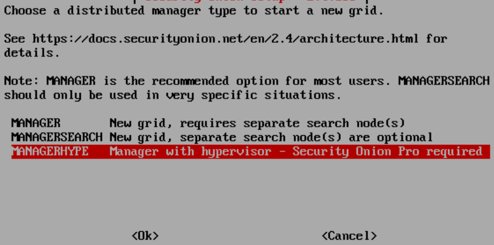
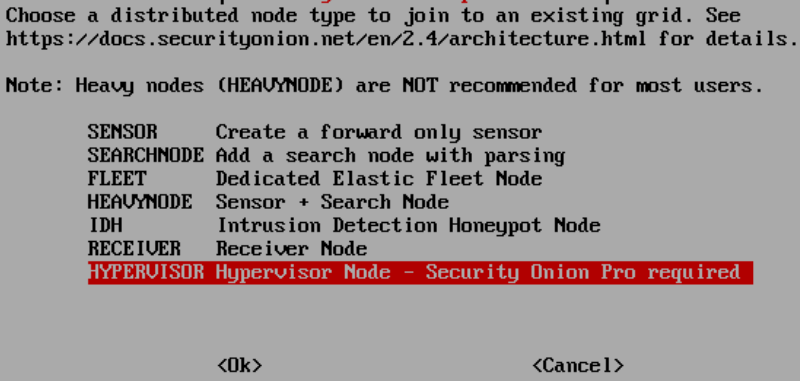
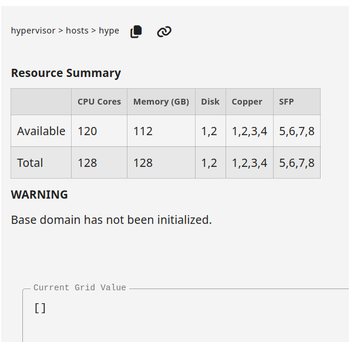
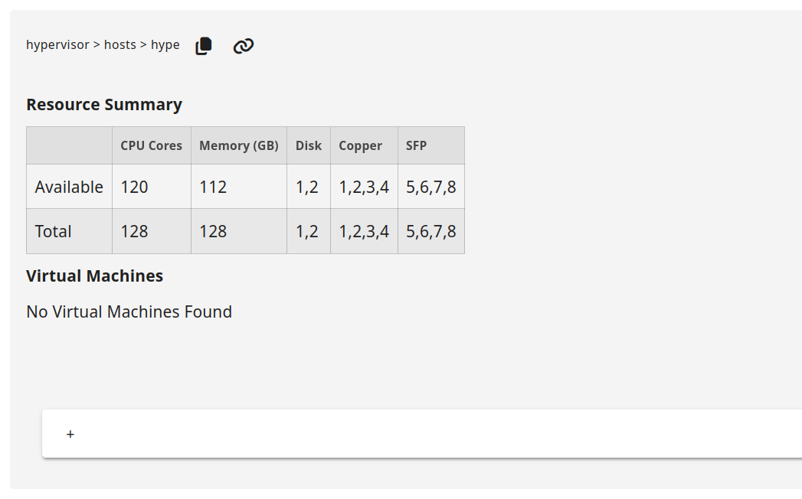
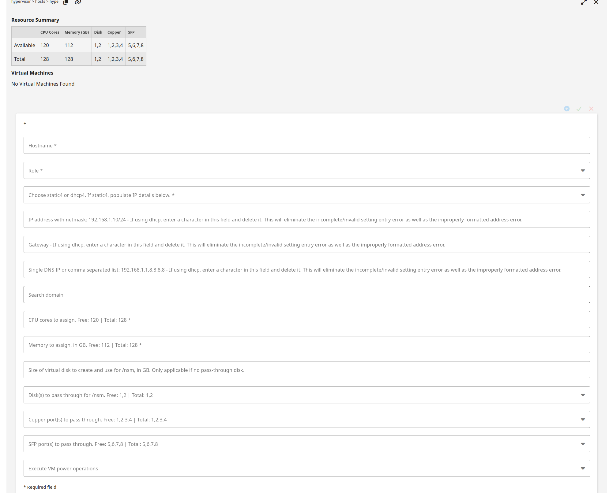
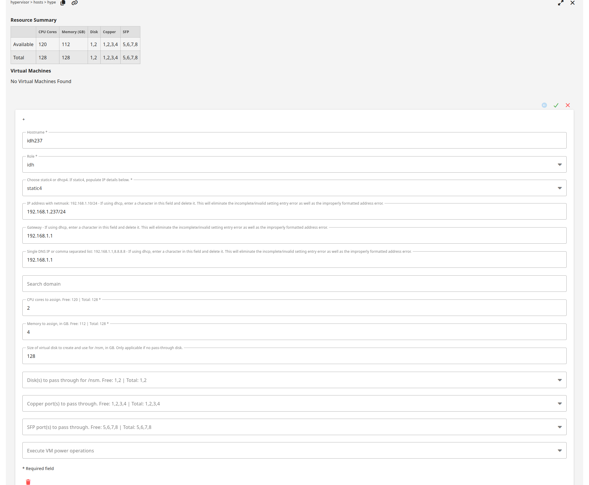
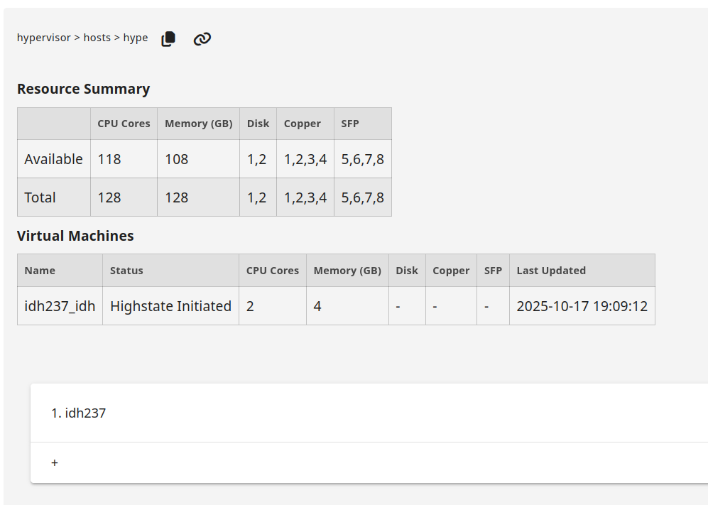
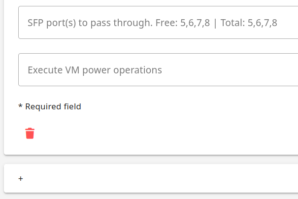
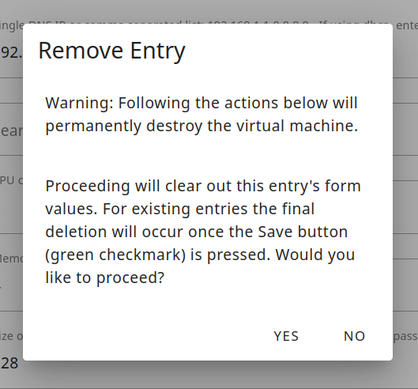
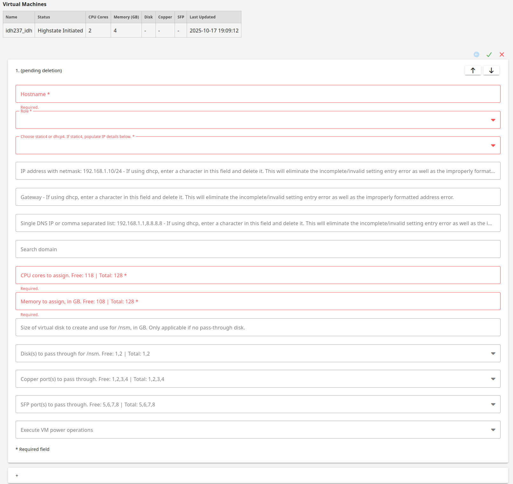

# Hypervisor

Starting with Security Onion version 2.4.170, Security Onion Pro users can create a hypervisor node that can run virtualized instances of Security Onion. If you have eligible machines with extra horsepower, you can use this feature to spin up additional Security Onion virtual machines (VMs) to take advantage of that extra power. This supports most major Security Onion node types and is especially helpful if you want to optimize your hardware's potential and expand your Elastic performance and retention. Contact your account manager to see if your hardware is supported.

!!! NOTE
    
    This is an enterprise-level feature of Security Onion. Contact Security Onion Solutions, LLC via our website at <https://securityonion.com/pro> for more information about purchasing a Security Onion Pro license to enable this feature.

## Minimum Requirements

Please note the following MINIMUM requirements for a Hypervisor or Managerhype node:

- 32 CPU cores
- 64GB RAM

## Host Hardware Reservation

The following resources will be reserved for the host machine and will be subtracted from the `Available` row under `Resource Summary`:

- **Hypervisor**
  
  - 8 CPU cores
  - 16GB RAM

- **Managerhype**
  
  - 16 CPU cores
  - 32GB RAM

## Airgap

If you are in an [airgap](airgap.md) environment, you will need to perform these steps prior to accepting the new hypervisor node in SOC Grid Members:
 
1. Download the Oracle 9 Qcow2 image from <https://download.securityonion.net/file/securityonion/OL9U5_x86_64-kvm-b253.qcow2>

2. Place OL9U5_x86_64-kvm-b253.qcow2 into /nsm/libvirt/boot/ on your manager node

## Adding a Manager + Hypervisor

Starting in 2.4.180, Security Onion Pro users can create a manager node that also has hypervisor capabilities. This node type is called a `managerhype`.

Install a new node, select the `DISTRIBUTED` deployment option, choose `New Deployment`, and then select the `Managerhype` option:

Once installation has completed, the new node will act as a manager node until a license key is added in SOC. After adding the license, it will take approximately 45 minutes for the hypervisor portion of the managerhype to be ready. This is due to the three highstates that are required to complete setup of the node.

If this is an airgap installation, then the instructions above will need to be followed prior to adding the license to SOC. The user will need to run `mkdir -p /nsm/libvirt/boot`.

The details under `Adding a Hypervisor`, regarding when the base domain is ready and VMs can be created, applies to the managerhype node as well as `Adding a Security Onion VM`.

## Adding a Hypervisor

Install a new node, select the `DISTRIBUTED` deployment option, choose `Existing Deployment`, and then select the `Hypervisor` option:

The manager will need to be able to connect to the hypervisor node by name so it will either need a DNS entry or you can manually add an entry in /etc/hosts on the manager.

Once the new hypervisor node has been accepted into the Grid, go to SOC Configuration, click the Options menu, enable advanced settings, and then navigate to `hypervisor` settings. It should look like this:

Once the base domain has been configured on the hypervisor (allowing VMs to be created), it should look like this:

## VM Storage Options for /nsm

The vast majority of data, for all node types, is stored in /nsm/. For a VM, there are three options available for /nsm storage. 

#. **Directory under /**

   This option uses a simple directory structure within the root filesystem. This is the default option if neither disk pass through or virtual disk are selected. The default image used for the VMs is 220GB, so this leaves about 200GB for storage on a fresh VM.

#. **Disk pass through**

   This method passes a physical disk directly to the VM, providing a dedicated disk to the node. It provides near-native disk performance and is ideal for production environments with high throughput requirements.

#. **Virtual disk**

   Added in 2.4.190, a virtual disk is created based on the size specified by the user in the SOC Grid Configuration and the space is pre-allocated on the hypervisor. The disk image file is not removed when the VM is deleted. A user may decide to leave this data around for a while, or delete it manually from the hypervisor where it is stored under `/nsm/libvirt/volumes`.

!!! NOTE
    
    If a user selects both a disk pass through and assigns a size for the virtual disk, then the disk pass through will be used for /nsm and the virtual disk will be ignored.

## Adding a Security Onion VM

Please note that hardware for a vm cannot be modified once a vm is created.

To create a new VM, click the plus sign. You should see a form like this. If using DHCP, please pay special attention to the DHCP notes:

Fill out the form and then click the green check to save and create the VM:

Once the VM is created and the first highstate is initiated, it should look like this:

## VM Creation Status

After a user has created a VM by filling out the form and clicking the green check mark, the web browser can be periodically refreshed to check the status of the VM creation. This is shown in the status column of the previous screenshot showing the highstate initiated.

Processing
  We detected that the user has requested to create a VM.

Hypervisor NSM Disk Full
  If the user requested a virtual disk for /nsm and there is not enough space on /nsm of the hypervisor, then this error will be seen. The user should delete this VM from the SOC Grid Configuration and either free up space on the hypervisor or create a new VM with a smaller /nsm.

IP Configuration
  Static or DHCP is being configured within the VM image before creation.

Starting Create
  The hypervisor has cloned the base image and has created the new VM image.

Executing Deploy Script
  The VM is being provisioned and the salt-minion is being bootstrapped.

Initialize Minion Pillars
  The VM has told the Security Onion manager to create its minion pillars.

Created Instance
  The VM creation process is complete.

Volume Creation
  If the user chose a virtual disk for /nsm, then this process creates it and fully allocates the space on the hypervisor. This step may take a while depending on the size of /nsm that was requested.

Volume Configuration
  The disk is being assigned to the VM.

Hardware Configuration
  The requested hardware has assigned to the VM.

Highstate Initiated
  The VM has been started and the first highstate is currently running. Subsequent highstates will not update the `Last Updated` column.

Destroyed Instance
  The instance has been destroyed. This VM will be removed from the `Virtual Machines` table after 48 hours.

## Stopping or Starting a VM

If you need to stop or start a VM, you can use the `Execute VM power operations` menu at the bottom of the VM form:

Here is the list of VM power operations and what they actually do:

- Reboot: gracefully reboot the VM (virt.reboot)
- Reset: forcefully reset the VM (virt.reset)
- Shutdown: gracefully shut down the VM (virt.shutdown)
- Start: start the VM (virt.start)
- Stop: forcefully stop the VM (virt.stop)

## Deleting a VM

To delete a VM, click the trash icon:

It will ask for confirmation:

Once you've confirmed, it will show that it is pending deletion:

The backend then deletes the VM, releases the hardware used by the VM, and updates the hypervisor annotation used by SOC. This process should take less than 30 seconds.

You will then need to refresh your web browser to see that CPU, memory, and free hardware have been updated. The deleted VM should then be listed as `Destroyed Instance`.

!!! WARNING
    
    If you delete a VM and attempt to immediately create a new VM prior to the backend releasing the hardware, then you will not be able to pass through the hardware that was previously used by the deleted VM.