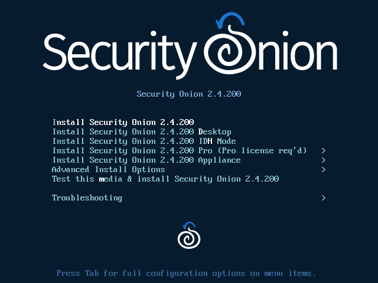

# Installation

!!! WARNING
    
    Please make sure that your hostname is correct during installation. Setup generates certificates based on the hostname and we do not support changing the hostname after Setup.

!!! NOTE
    
    If you want to deploy in the cloud using one of our official cloud images, you can skip to the [Amazon Cloud](cloud-amazon.md), [Azure Cloud](cloud-azure.md), or [Google Cloud](cloud-google.md) sections.

Having downloaded our ISO image as shown in the [Download](download.md) section, it's now time to install! 



- Review the [Hardware](hardware.md) and [Release Notes](release-notes.md) sections.
- Download and verify our ISO image as shown in the [Download](download.md) section.
- Boot the ISO in a machine that meets the minimum hardware specs.
- Follow the prompts to complete the installation and reboot.
- You may need to eject the ISO image or change the boot order of the machine to boot from the newly installed OS.
- Login using the username and password you set in the installer.
- Security Onion Setup will automatically start. If for some reason you have to exit Setup and need to restart it, you can log out of your account and then log back in and it should automatically start. If that doesn't work, you can manually run it as follows:

```
sudo SecurityOnion/setup/so-setup iso
```

- Proceed to the [Configuration](configuration.md) section.