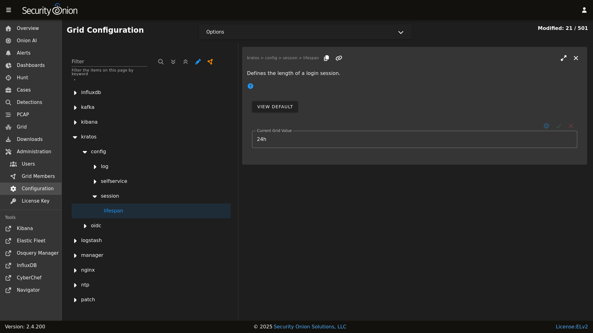

# Kratos

[SOC](security-onion-console.md) authentication is handled by Kratos. You can read more about Kratos at <https://github.com/ory/kratos>.

## Configuration

You can configure Kratos by going to [Administration](administration.md) --> Configuration --> kratos.

## More Information

!!! NOTE
    
    For more information about Kratos, please see <https://github.com/ory/kratos>.
