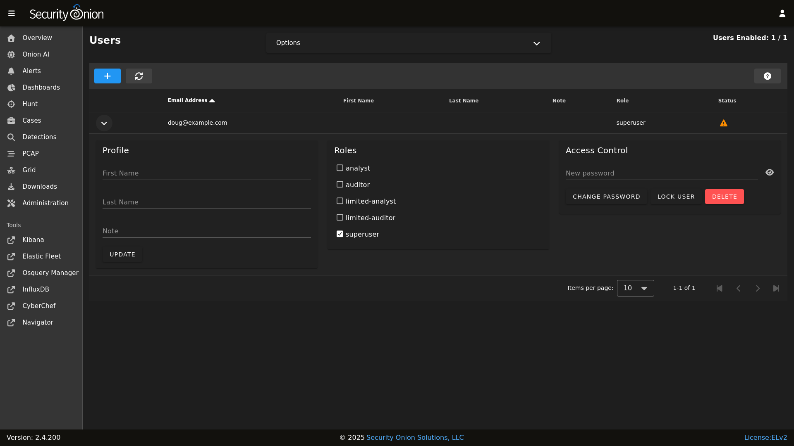

# Listing Accounts

## OS

Operating System (OS) user accounts are stored in `/etc/passwd`.  You can get a list of all OS accounts using the following command:


```
cut -d: -f1 /etc/passwd
```

If you want a list of user accounts (not service accounts), then you can filter `/etc/passwd` for accounts with a UID greater than 999 like this:


```
cat /etc/passwd | awk -F: '$3 > 999 {print ;}' | cut -d: -f1
``` 
  
## SOC

You can get a list of users in [SOC](security-onion-console.md) by navigating to the [Administration](administration.md) interface and then clicking `Users`:


To see detail on an individual user account, click the button on the left side of the row to expand the user account:



For more information about the Users page, please see the [Administration](administration.md) section.