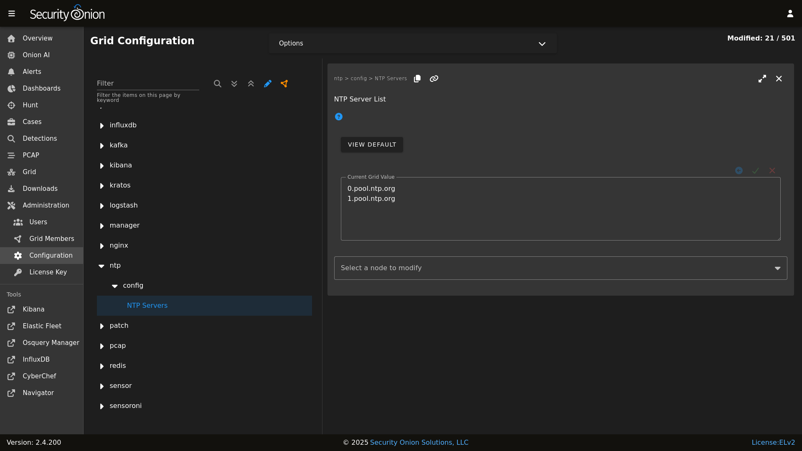

# NTP

Depending on how you installed, the underlying operating system may be configured to pull time updates from the NTP Pool Project and perhaps others as a fallback. You may want to change this default NTP config to your preferred NTP provider by going to [Administration](administration.md) --> Configuration --> ntp.

For a distributed deployment, it's vitally important that all nodes have their clock synchronized. Otherwise, you may run into issues where logs or other types of data appear to be missing.

For more information about the operating system time, please see the [Time Zones](time-zones.md) section.