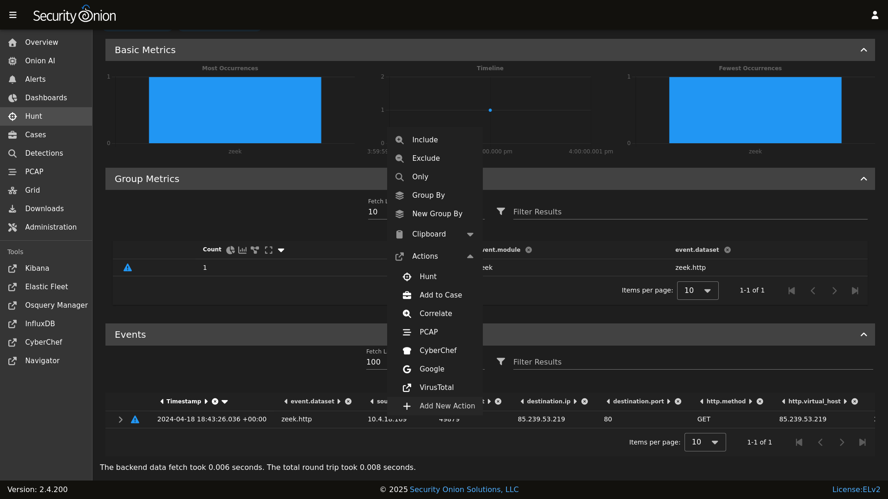
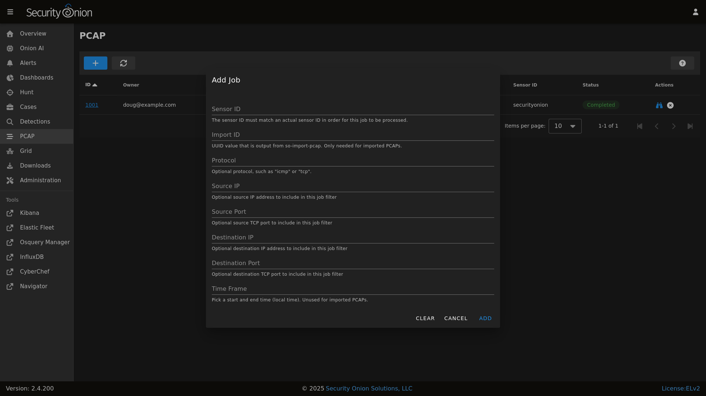
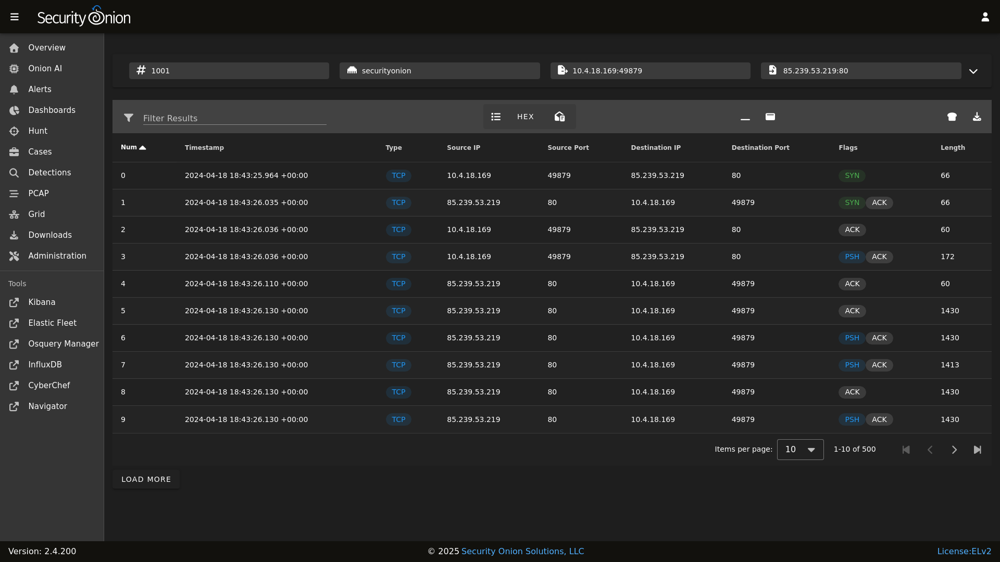
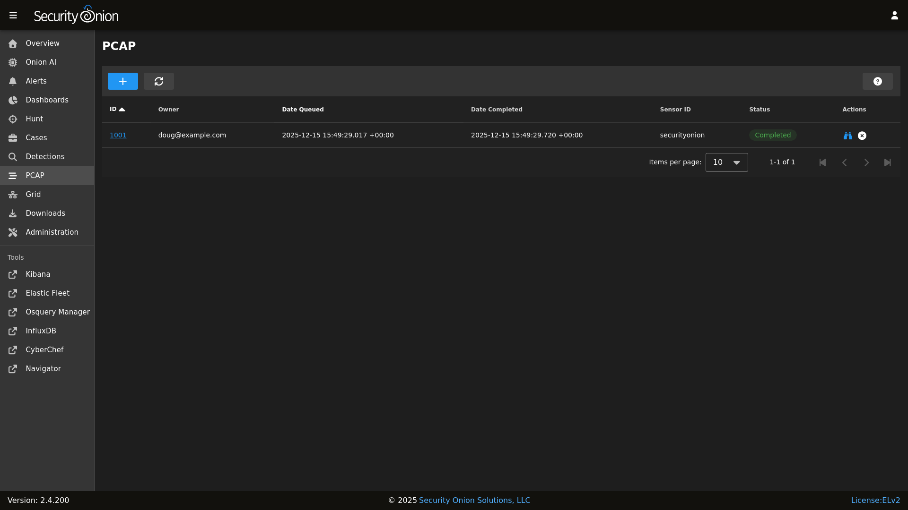

# PCAP

[Security Onion Console](security-onion-console.md) includes a PCAP interface which allows you to access your full packet capture that was written to disk by [Suricata](suricata.md). 

You can access PCAP in two different ways. The first and most common option is to pivot to PCAP from a particular event in [Alerts](alerts.md), [Dashboards](dashboards.md), or [Hunt](hunt.md) by choosing the PCAP action on the action menu. 

The second and less common option is to go directly to the PCAP interface, click the blue + button, and then put in your search criteria to search for a particular stream.

Regardless of which of these two options you choose, Security Onion should then locate the stream and render a high level overview of the packets.

If there are many packets in the stream, you can use the `LOAD MORE` button, `Rows per page` setting, and arrows to navigate through the list of packets. 

You can drill into individual rows to see the actual payload data. There are buttons at the top of the table that control what data is displayed in the individual rows. If you disable the `Show all packet data` and `HEX` buttons, then you get an ASCII transcript.

You can select text with your mouse and then use the context menu to send that selected text to [CyberChef](cyberchef.md), Google, or other destinations defined in the actions list.

There are two buttons on the right side of the table header. The first will send all visible packet data to [CyberChef](cyberchef.md). Please note that this only sends packet data that is currently being displayed, so if you are looking at a large stream you may need to use the `LOAD MORE` button to display all packets in the stream. The second button on the far right allows you to download the full PCAP file. You can then open the PCAP file using [NetworkMiner](networkminer.md), [Wireshark](wireshark.md), or any other standard libpcap tool. You should typically avoid doing PCAP analysis on your normal desktop environment, so you may want to consider opening the PCAP file in a [Security Onion Desktop](security-onion-desktop.md) instance.

Once you've viewed one or more PCAPs, you will see them listed on the main PCAP page.

When you are done with a PCAP, you may want to delete it using the `X` button on the far right. This deletes the cached PCAP file saved at `/nsm/soc/jobs/`.

## Troubleshooting

If you have trouble retrieving PCAP, here are some things to check:

- Verify that full packet capture is enabled via [Suricata](suricata.md).
- Check to see if you have any [BPF](bpf.md) configuration that may cause [Suricata](suricata.md) to ignore the traffic.
- Check [Grid](grid.md) and verify that all services are running properly.
- Check [influxdb](influxdb.md) and verify that PCAP Retention is long enough to include the stream you're looking for.
- Make sure that there is plenty of free space on `/nsm` to carve the stream and write the output to disk.
