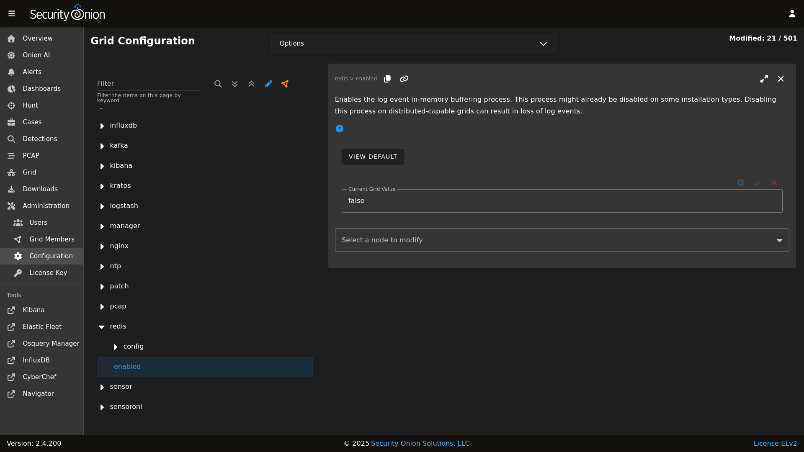

# Redis

From <https://redis.io/>:

> Redis is an open source (BSD licensed), in-memory data structure store, used as a database, cache and message broker. It supports data structures such as strings, hashes, lists, sets, sorted sets with range queries, bitmaps, hyperloglogs and geospatial indexes with radius queries.

On Standalone (non-Eval) installations and distributed deployments, [Logstash](logstash.md) on the manager node outputs to Redis. Search nodes can then consume from Redis.

## Queue

To see how many logs are in the Redis queue:


```bash
sudo so-redis-count
```

If the queue is backed up and doesn't seem to be draining, try stopping [Logstash](logstash.md) on the manager node:


```bash
sudo so-logstash-stop
```

Then monitor the queue to see if it drains:


```bash
watch 'sudo so-redis-count'
```

If the Redis queue looks okay, but you are still having issues with logs getting indexed into [Elasticsearch](elasticsearch.md), you will want to check the [Logstash](logstash.md) statistics on the search node(s).

## Tuning

Security Onion configures Redis to use 812MB of your total system memory. If you have sufficient RAM available, you may want to increase the `redis_maxmemory` setting by going to [Administration](administration.md) --> Configuration --> Redis. This value is in Megabytes so to set it to use 8 gigs of ram you would set the value to 8192.



[Logstash](logstash.md) on the manager node is configured to send to Redis.  For best performance, you may want to tune the `ls_pipeline_batch_size` value at [Administration](administration.md) --> Configuration --> logstash_settings to find the sweet spot for your deployment.

!!! NOTE
    
    For more information about the [Logstash](logstash.md) output plugin for Redis, please see:
    <https://www.elastic.co/guide/en/logstash/current/plugins-outputs-Redis.html>

[Logstash](logstash.md) on search nodes pulls from Redis.  For best performance, you may want to tune `ls_pipeline_batch_size` and `ls_input_threads` at [Administration](administration.md) --> Configuration --> logstash_settings to find the sweet spot for your deployment.

!!! NOTE
    
    For more information about the [Logstash](logstash.md) input plugin for Redis, please see:
    <https://www.elastic.co/guide/en/logstash/current/plugins-inputs-Redis.html>

## Diagnostic Logging

Redis logs can be found at `/opt/so/log/redis/`. Depending on what you're looking for, you may also need to look at the [Docker](docker.md) logs for the container:


```bash
sudo docker logs so-redis
```

## More Information

!!! NOTE
    
    For more information about Redis, please see <https://redis.io/>.