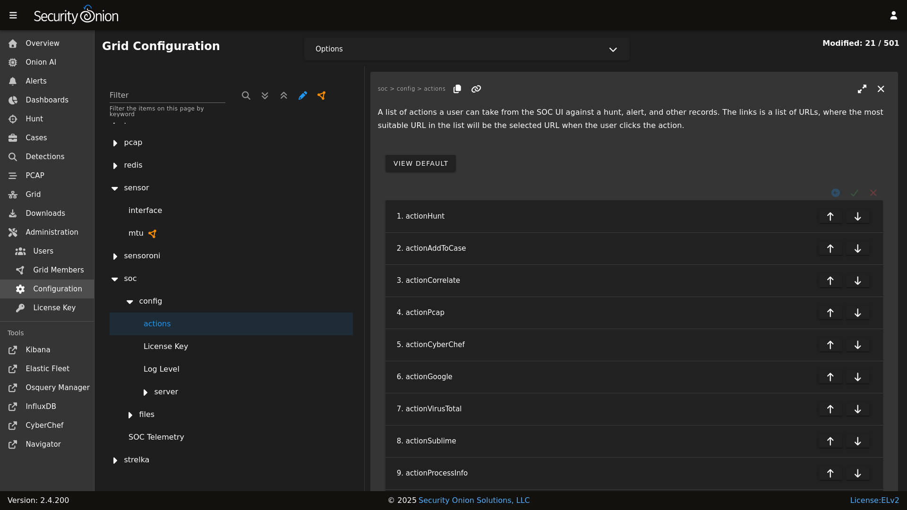

# Security Onion Console Customization

You can customize [Security Onion Console](security-onion-console.md) by going to [Administration](administration.md) --> Configuration --> SOC. 



Below are some ways in which you can customize SOC. Once all customizations are complete, you can make the changes take effect by clicking the `Options` bar at the top and then clicking the `SYNCHRONIZE GRID` button.


## Login Page

You can customize the SOC login page with a login banner by going to [Administration](administration.md) --> Configuration --> SOC --> files --> SOC --> Login Banner. The login banner uses the common Markdown (.md) format and you can learn more about that at <https://markdownguide.org>.

## Overview Page

After logging into SOC, you'll start on the main SOC Overview page which can be customized as well. You can customize this by going to [Administration](administration.md) --> Configuration --> SOC --> files --> SOC --> Overview Page. This uses Markdown format as mentioned above.

You can add images but they must be hosted from another host that is accessible by the user's browser. For example, let's use one of the images from our online documentation. The markdown to add that image would look like this:


## Links

You can also customize the links on the left side. To do so, go to [Administration](administration.md) --> Configuration --> SOC --> server --> client --> tools.

## Reverse DNS

When you are viewing IP addresses in [Alerts](alerts.md), [Dashboards](dashboards.md), or [Hunt](hunt.md), you might want to enable automatic reverse DNS lookups to provide more information. You can do so by going to [Administration](administration.md) --> Configuration --> SOC --> config --> server --> enableReverseLookup.

## Local Lookups

If you don't want to enable reverse DNS lookups for all IP addresses but do have a subset of IP addresses that you would like to resolve to hostnames in SOC, then you can create a CSV file at `/nsm/custom-mappings/ip-descriptions.csv` on your Manager and populate the file with IP addresses and descriptions as follows:


```
IP,Description
```

[Elasticsearch](elasticsearch.md) will then ingest the CSV and use the contents to populate a new index called `so-ip-mappings`.

When you are viewing IP addresses in [Alerts](alerts.md), [Dashboards](dashboards.md), or [Hunt](hunt.md), [Security Onion Console](security-onion-console.md) will check the local mappings first. If it doesn't find a match, then it will attempt a reverse DNS lookup (if enabled).

If you later need to make changes to your local IP/Descriptions mappings, make the changes in `/nsm/custom-mappings/ip-descriptions.csv` and [Elasticsearch](elasticsearch.md) will automatically update the `so-ip-mappings` index.

## Cases

[Cases](cases.md) comes with presets for things like category, severity, TLP, PAP, tags, and status. You can modify these presets by going to [Administration](administration.md) --> Configuration --> SOC --> server --> client --> case --> presets.

## Session Timeout

The default timeout for user login sessions is 24 hours. This is a fixed timespan and will expire regardless of whether the user is active or idle in SOC. You can configure this by going to [Administration](administration.md) --> Configuration --> kratos --> config --> session --> lifespan.

## Custom Queries

If you'd like to add your own custom queries to [Alerts](alerts.md), [Cases](cases.md), [Dashboards](dashboards.md), [Detections](detections.md) or [Hunt](hunt.md), you can go to [Administration](administration.md) --> Configuration --> SOC --> config --> server --> client and then select the specific app you'd like to modify. 

!!! WARNING
    
    When you save your custom queries, SOC saves the entire list of queries (including our default queries included in the product). So if you update to a new version which includes new or updated default queries, you won't see the new or updated default queries since your custom query list is overriding the default.

To see all available fields for your queries, go down to the Events table and then click the arrow to expand a row. It will show all of the individual fields from that particular event.

For example, suppose you want to add GeoIP information like `source.geo.region_iso_code` or `destination.geo.region_iso_code` to [Alerts](alerts.md). You would go to [Administration](administration.md) --> Configuration --> SOC --> config --> server --> client --> alerts --> queries and insert the following line wherever you want it show up in the query list:


```
{ "name": "Group By Source IP/Port/Geo, Destination IP/Port/Geo, Name", "query": "* | groupby source.ip source.port source.geo.region_iso_code destination.ip destination.port destination.geo.region_iso_code rule.name" },
```

Please note that some events may not have GeoIP information and this query would only show those alerts that do have GeoIP information.

## Action Menu

[Alerts](alerts.md), [Dashboards](dashboards.md), and [Hunt](hunt.md) have an action menu with several default actions. If you'd like to add your own custom HTTP GET or POST actions, you can go to [Administration](administration.md) --> Configuration --> SOC --> actions and click the plus sign at the bottom of the list. Then fill out the fields and save the new action.

## Escalation

[Alerts](alerts.md), [Dashboards](dashboards.md), and [Hunt](hunt.md) display logs with a blue triangle that allows you to escalate the event. This defaults to our [Cases](cases.md) interface. If for some reason you want to escalate to a different case management system, you can change this setting. You can go to [Administration](administration.md) --> Configuration --> SOC --> server --> modules --> cases and specify one of the following values:

- `SOC` - Enables the built-in Case Management, with our Escalation menu (default).

- `elasticcases` - Enables escalation to the [Elastic Cases](https://www.elastic.co/guide/en/security/current/cases-overview.html) tool. Escalations will always open a new case; there will not be an advanced escalation menu popup.  This module will use the same user/pass that SOC uses to talk to Elastic. Note, however, that Elastic cases is actually a Kibana feature, therefore, when this setting is used, SOC will be communicating with the local Kibana service (via its API) for case escalations.