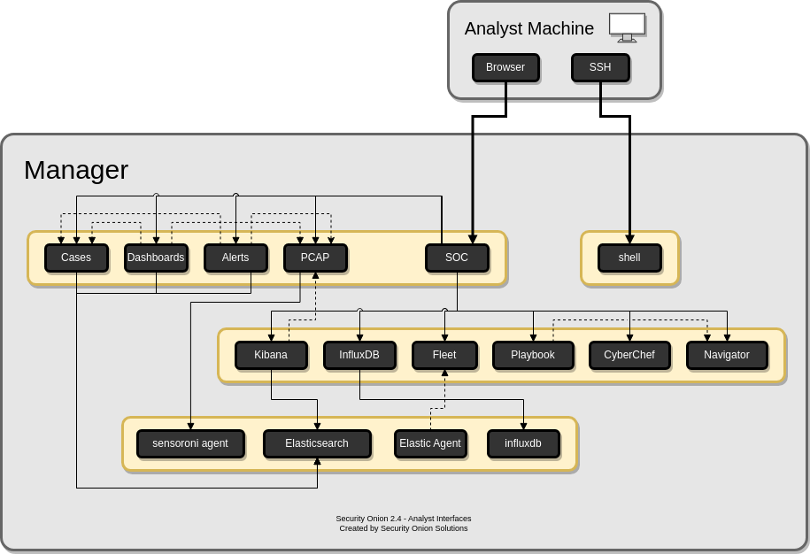
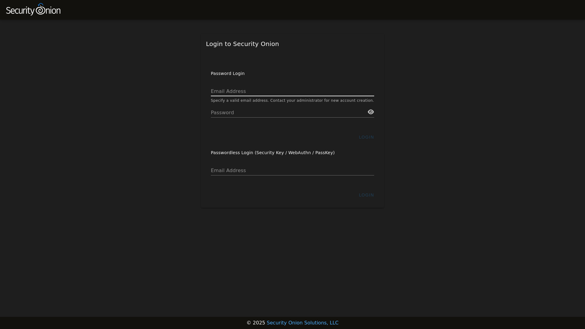
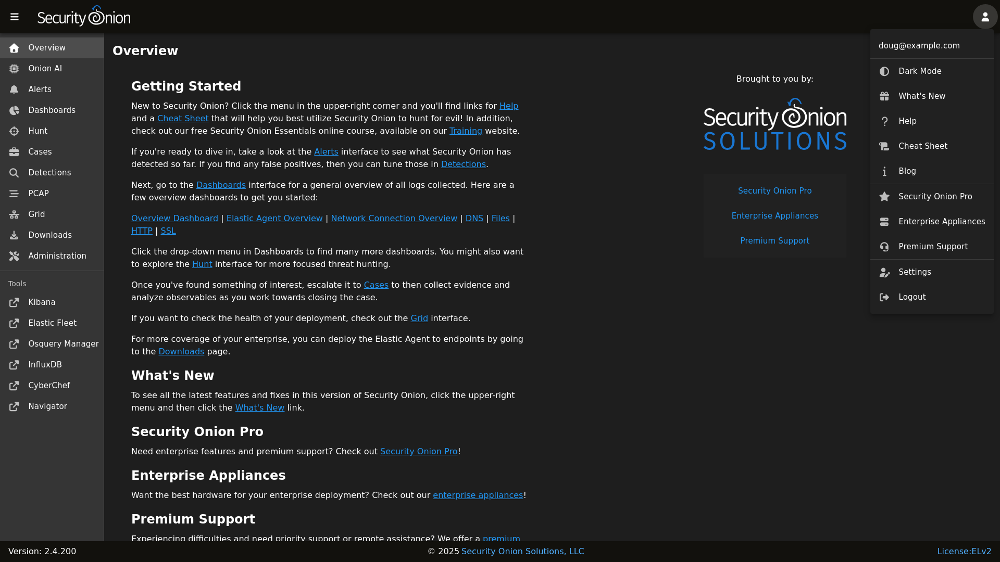

# Security Onion Console

Once all configuration is complete, you can then connect to Security Onion Console with your web browser. We recommend chromium-based browsers such as Google Chrome. Other browsers may work, but fully updated chromium-based browsers provide the best compatibility. 

Depending on the options you chose in the installer, connect to the IP address or hostname of your Security Onion installation. Then login using the email address and password that you specified in the installer. 

Once logged in, you'll notice the user menu in the upper-right corner. This allows you to manage your user settings and access documentation and other resources.

On the left side of the page, you'll see links for analyst tools like [Alerts](alerts.md), [Dashboards](dashboards.md), [Hunt](hunt.md), [Cases](cases.md), [Detections](detections.md), [PCAP](pcap.md), [Kibana](kibana.md), [CyberChef](cyberchef.md), and [Attack Navigator](attack-navigator.md). While [Alerts](alerts.md), [Dashboards](dashboards.md), [Hunt](hunt.md), [Cases](cases.md), [Detections](detections.md), and [PCAP](pcap.md) are built into SOC itself, the remaining tools are external and will spawn separate browser tabs.

If you'd like to customize SOC, please see the [SOC Customization](security-onion-console-customization.md) section. If you'd like to learn more about SOC logs, please see the [SOC Logs](security-onion-console-logs.md) section.

## Table of Contents

- [Alerts](alerts.md)
- [Dashboards](dashboards.md)
- [Hunt](hunt.md)
- [Cases](cases.md)
- [Detections](detections.md)
- [PCAP](pcap.md)
- [Grid](grid.md)
- [Downloads](downloads.md)
- [Administration](administration.md)
- [Kibana](kibana.md)
- [Elastic Fleet](elastic-fleet.md)
- [Osquery Manager](osquery-manager.md)
- [InfluxDB](influxdb.md)
- [CyberChef](cyberchef.md)
- [Attack Navigator](attack-navigator.md)