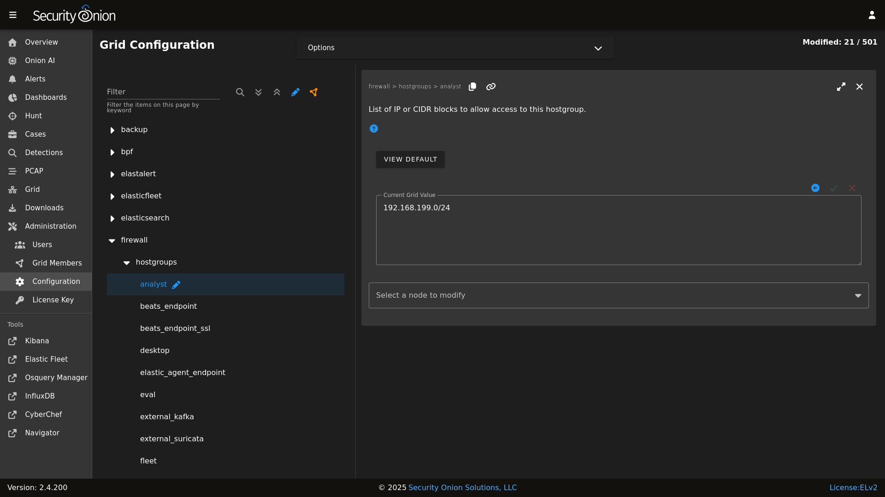

# Security Onion Desktop Overview

Full-time analysts may want to use a dedicated Security Onion desktop. This allows you to investigate pcaps, malware, and other potentially malicious artifacts without impacting your Security Onion deployment or your usual desktop environment.

!!! NOTE
    
    Security Onion Desktop only supports Oracle Linux 9, so you'll either need to use our ISO image (recommended) or a [network installation](network-installation.md) on top of Oracle Linux 9 (unsupported).

Security Onion Desktop consists of a full desktop environment including [Chromium](chromium.md), [NetworkMiner](networkminer.md), [Wireshark](wireshark.md), and other analyst tools.
 
**Installation**

There are a few different ways to install Security Onion Desktop:

- Our ISO image includes a boot menu option for Desktop installs that will partition your disk appropriately and immediately perform a Desktop installation. The minimum disk size is 50GB.

- The `so-desktop-install` command is totally independent of the standard setup process, so you can run it before or after setup or not run setup at all if all you really want is the Analyst desktop itself.

- If you’re doing a network installation on Oracle Linux 9 (NOT using our ISO image), then in our normal Setup wizard, you can choose `OTHER` and then choose `ANALYST`. Please note that network installations in general are unsupported.

!!! NOTE
    
    Depending on how you install, it may take a full [salt](salt.md) cycle before all desktop components are installed and ready for use.

**Joining to Grid**

You can optionally join your Desktop installation to your grid. This allows it to pull updates from the grid and automatically trust the grid's HTTPS certificate. It also updates the manager's firewall to allow the Desktop installation to connect. Desktop nodes display on the [Grid](grid.md) page along with the other Grid nodes.

If you choose not to join your Desktop installation to your grid, then you may need to allow the traffic through the host-based [firewall](firewall.md) by going to [Administration](administration.md) --> Configuration --> firewall --> hostgroups --> analyst.



**Disabling**

The analyst desktop is controlled via [salt](salt.md) pillar. If you need to disable the Security Onion Desktop environment, find the `workstation` setting in your [salt](salt.md) pillar and change `enabled: true` to `enabled: false`:


```yaml
workstation:
  gui:
    enabled: false
```
