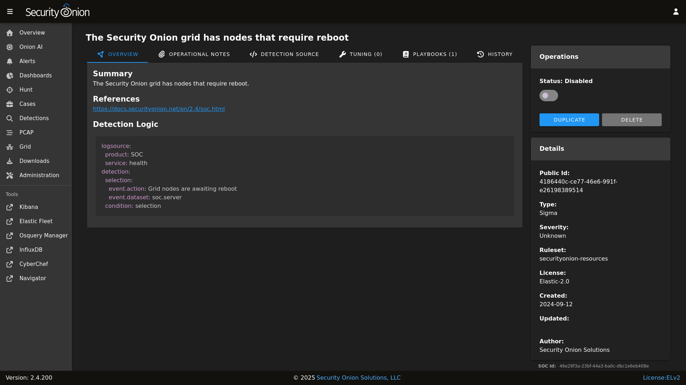
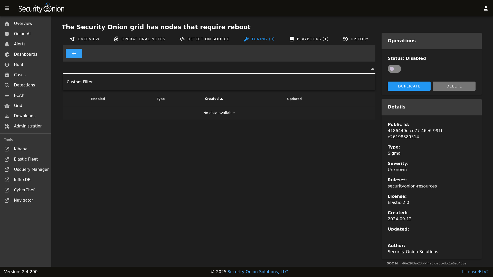
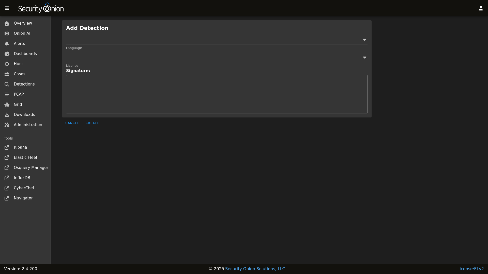

# Sigma

Sigma rules are loaded into [ElastAlert](elastalert.md) to monitor incoming logs for suspicious or noteworthy activity. Active Sigma rules generate alerts that can then be found in [Alerts](alerts.md).

From <https://github.com/SigmaHQ/sigma>:

> Sigma is a generic and open signature format that allows you to describe relevant log events in a straightforward manner. The rule format is very flexible, easy to write and applicable to any type of log file. The main purpose of this project is to provide a structured form in which researchers or analysts can describe their once developed detection methods and make them shareable with others. Sigma is for log files what Snort is for network traffic and YARA is for files.

## Managing Existing Sigma Rules

You can manage existing Sigma rules via [Detections](detections.md). There are two ways to do so:

- From the main [Detections](detections.md) interface, you can search for the desired detection and click the binoculars icon.
- From the [Alerts](alerts.md) interface, you can click an alert and then click the `Tune Detection` menu item.

Once you've used one of these methods to reach the detection detail page, you can check the Status field in the upper-right corner and use the slider to enable or disable the detection.



To tune the detection:

- Click the Tuning tab
- Click the blue + button
- Select the type of tuning (Custom Filter)
- Enter your custom filter in the Custom Filter field
- Click the `CREATE` button to create and enable the Override



Custom Filters are Sigma Search Identifiers and will be applied like so: `"($ORIGINAL_CONDITION) and not 1 of sofilter*"`

For example, suppose that you have an [IDH](idh.md) node installed with the HTTP webserver enabled. Your nightly vulnerability scan is connecting to it and generating an alert from the `Security Onion IDH - HTTP Access` detection. To filter out connection attempts from this scanner, you would add the following Custom Filter to this detection:

```yaml
sofilter:
  src_ip|cidr: 192.168.55.45/32
```

Once you save this filter, it is enabled by default for this detection. Clicking on the `Detection Source` tab and then on `Convert` will show you what the new EQL query looks like, which should include a filter for the IP address.

For more information on Sigma rule syntax, please see the Sigma documentation at <https://sigmahq.io/docs/basics/rules.html#detection>.

## Adding New Sigma Rules

To add a new Sigma rule, go to the main [Detections](detections.md) page and click the blue + button between Options and the query bar. A form will appear where you will:

1. Click the Language drop-down and select `Sigma`.
2. Optionally specify a license.
3. Add the signature.
4. Click the `CREATE` button and the detection should deploy to your Grid at the next 15-minute cycle.



## Sigma Configuration

- Navigate to [Administration](administration.md) --> Configuration.
- At the top of the page, click the `Options` menu and then enable the `Show advanced settings` option.
- Navigate to `SOC` --> `config` --> `server` --> `modules` --> `elastalertengine`.

Once you've reached this location, here are some common settings.

### Sigma Update Frequency

By default, Security Onion checks for new Sigma rules every 24 hours. You can change this value at `SOC` --> `config` --> `server` --> `modules` --> `elastalertengine` --> `communityRulesImportFrequencySeconds`.

### Sigma Packages

You can choose from different Sigma packages:

<https://github.com/SigmaHQ/sigma/blob/master/Releases.md>

You can modify this setting via `SOC` --> `config` --> `server` --> `modules` --> `elastalertengine` --> `sigmaRulePackages`.

### Custom Sigma Repositories

You can configure Security Onion to pull Sigma rules from custom git repos via `SOC` --> `config` --> `server` --> `modules` --> `elastalertengine` --> `rulesRepos` --> `default`. 

Repos can be accessed via https or from the local filesystem. For example:


```
file:///nsm/rules/detect-sigma/repos/my-custom-rep
```

### Enable Sigma Rules on Import


```
`SOC` > `config` > `server` > `modules` > `elastalertengine` > `enabledSigmaRules` > `default`
```

This configuration options allows you to specify which rules are automatically enabled upon initial import. The format for this filter is a YAML list that supports flexible filtering criteria based on a number of fields in a Sigma rule. A rule is enabled only if it matches all specified filters - if there is more than one filter for a field, then it has to match at least one.

Configuration Format

Each item in the YAML list represents a set of filters, using the following fields:

- `ruleset`: List of strings. Specifies the ruleset(s) to filter by (e.g., "core", "securityonion-resources", "*" for any ruleset).
- `level`: List of strings. Specifies the severity level(s) (e.g., "critical", "high", "*" for any level. This is not a greater than or equal check - just a string match).
- `product`: List of strings. Specifies the product(s) to filter by (e.g., "windows", "*" for any products).
- `category`: List of strings. Specifies the event category or categories (e.g., "process_creation", "registry_event", "*" for any category).
- `service`: List of strings. Specifies the service(s) to filter by (e.g., "security", "dns-client", "*" for any service).

For example:

```yaml
# Enable all critical and high rules from the "securityonion-resources" ruleset
- ruleset: ["securityonion-resources"]
  level: ["critical", "high"]
  product: ["*"]
  category: ["*"]
  service: ["*"]
```