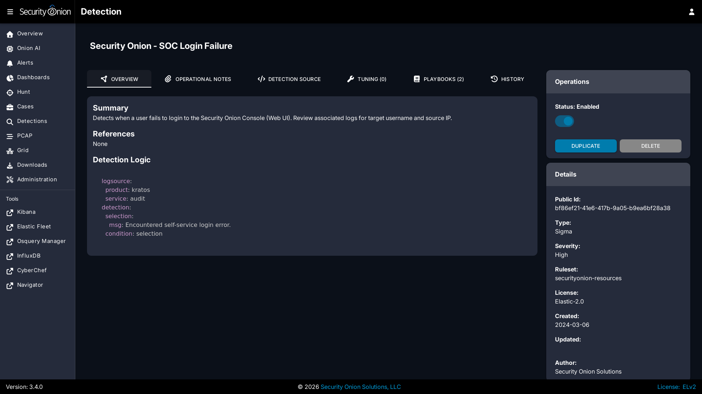
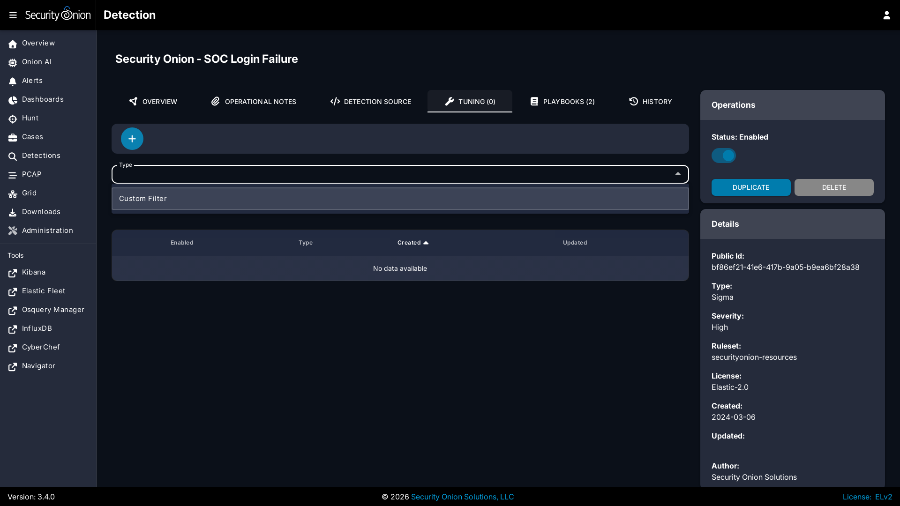
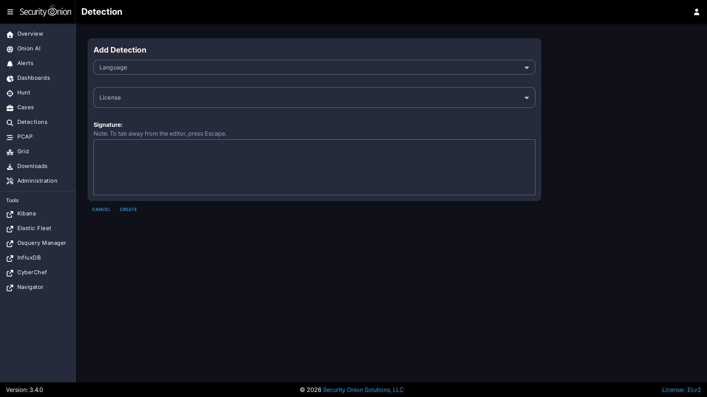

# Sigma

Sigma rules are loaded into [ElastAlert](elastalert.md) to monitor incoming logs for suspicious or noteworthy activity. Active Sigma rules generate alerts that can then be found in [Alerts](alerts.md).

From <https://github.com/SigmaHQ/sigma>:

> Sigma is a generic and open signature format that allows you to describe relevant log events in a straightforward manner. The rule format is very flexible, easy to write and applicable to any type of log file. The main purpose of this project is to provide a structured form in which researchers or analysts can describe their once developed detection methods and make them shareable with others. Sigma is for log files what Snort is for network traffic and YARA is for files.

## Managing Existing Sigma Rules

You can manage existing Sigma rules via [Detections](detections.md). There are two ways to do so:

- From the main [Detections](detections.md) interface, you can search for the desired detection and click the binoculars icon.
- From the [Alerts](alerts.md) interface, you can click an alert and then click the `Tune Detection` menu item.

Once you've used one of these methods to reach the detection detail page, you can check the Status field in the upper-right corner and use the slider to enable or disable the detection.



To tune the detection:

- Click the Tuning tab
- Click the blue + button
- Select the type of tuning (Custom Filter)
- Enter your custom filter in the Custom Filter field
- Click the `CREATE` button to create and enable the Override



Custom Filters are Sigma Search Identifiers and will be applied like so: `"($ORIGINAL_CONDITION) and not 1 of sofilter*"`

For example, suppose that you have an [IDH](idh.md) node installed with the HTTP webserver enabled. Your nightly vulnerability scan is connecting to it and generating an alert from the `Security Onion IDH - HTTP Access` detection. To filter out connection attempts from this scanner, you would add the following Custom Filter to this detection:

```yaml
sofilter:
  src_ip|cidr: 192.168.55.45/32
```

Once you save this filter, it is enabled by default for this detection. Clicking on the `Detection Source` tab and then on `Convert` will show you what the new EQL or ES|QL query looks like, which should include a filter for the IP address.

For more information on Sigma rule syntax, please see the Sigma documentation at <https://sigmahq.io/docs/basics/rules.html#detection>.

## Adding New Sigma Rules

To add a new Sigma rule, go to the main [Detections](detections.md) page and click the blue + button between Options and the query bar. A form will appear where you will:

1. Click the Language drop-down and select `Sigma - Single event` for a rule that alerts on each matching event, or `Sigma - Correlation` for a [correlation rule](#correlation-rules).
2. Optionally specify a license.
3. Add the signature.
4. Click the `CREATE` button and the detection should deploy to your grid at the next 15-minute cycle.



## Correlation Rules

A Sigma correlation alerts on a pattern across several events rather than on one event: many failed logins from one source, an unusual number of distinct values in a field, or two kinds of event on the same host.

Correlations require ES|QL; see [ES|QL Settings](#esql-settings). On the Detections page, the `Detection Type - Sigma (Elastalert) - Correlations` query lists them.

### Structure

A correlation is one detection containing multiple YAML documents separated by `---`. The first document is the correlation and gives the detection its id, title and severity. Every document after it is a single-event rule the correlation refers to by its `name` or `id`. All referenced rules must be in the same detection; a reference that cannot be found is rejected on save.

A Custom Filter on a correlation applies to each referenced rule, so the excluded events are not counted.

```yaml
title: Excessive Distinct DNS Queries From A Single Host
id: 6f3b1c94-2d7e-4a58-9c21-8e4d0b5a7f13
correlation:
    type: value_count
    rules:
        - so_dns_query_observed
    group-by:
        - source.ip
    timespan: 10m
    condition:
        field: dns.query.name
        gte: 40
level: medium
---
title: DNS Query Observed
name: so_dns_query_observed
logsource:
    category: network
    service: dns
detection:
    selection:
        dns.query.name|exists: true
    condition: selection
```

### Supported Types

Every type requires `group-by` and `timespan`. Events missing a `group-by` field are not counted; a placeholder such as an empty string or `-` is a value, so filter it out in the referenced rule if needed.

| Type | Matches when | Also requires |
| --- | --- | --- |
| `event_count` | matching events cross a threshold | `condition` |
| `value_count` | distinct values of a field cross a threshold | `condition` with `field` |
| `temporal` | the referenced rules match within the window; an event matching several of them counts for each | two or more `rules`; an optional `condition` such as `gte: 2` means any two of them |
| `value_sum` | the sum of a field crosses a threshold | `condition` with `field` |
| `value_avg` | the mean of a field crosses a threshold | `condition` with `field` |
| `value_percentile` | a percentile of a field crosses a threshold | `condition` with `field` and `percentile` |

A `condition` has exactly one comparison: `gt`, `gte`, `lt`, `lte`, `eq` or `neq`. A range, such as `gte` and `lte` together, is rejected on save. Use whole numbers for the threshold and for `percentile`, which must be between 0 and 100: a fraction is currently truncated, so `gt: 2.5` acts as `gt: 2`. The comparison also decides how events are counted; see [How Events Are Counted](#how-events-are-counted).

The `field` of `value_sum`, `value_avg` and `value_percentile` must be numeric. Elasticsearch rejects the rule on every run otherwise, and the error appears in `/opt/so/log/elastalert/elastalert.log`.

Security Onion does not support these parts of the Sigma correlation specification, and rejects them on save:

- `temporal_ordered`, which requires the rules to match in a set order. Use `temporal` instead.
- A correlation that refers to another correlation. List the single-event rules directly.
- `generate: true`, which also alerts on each referenced rule by itself. Add the rule as its own detection instead.
- `aliases`, which groups by fields with different names in each rule. Use the same field name in each rule.

### Timespan

`timespan` is how close together the correlated events must be: `Xs`, `Xm`, `Xh`, or `Xd`, for example `10m`. Correlations run each time ElastAlert runs, every 3 minutes by default. For how events are grouped into windows, see [How Events Are Counted](#how-events-are-counted).

### Alert Contents

An aggregated result holds only the counts and group-by fields, not the individual events. Listing `fields` on a referenced rule carries their values into the alert.

Each correlation alert has a one-line summary in `event.reason`, shown at the top of Guided Analysis, for example `5 events for user.name jdoe in 14 seconds`. A `summary` on the correlation document replaces it:

```yaml
summary: '%count% failed logins for %user.name% in %duration%, from %source.ip%'
```

`%count%`, `%start%`, `%end%` and `%duration%` are always available, as is any `group-by` field or field listed under `fields`. A placeholder that cannot be filled is left as written, so a typo shows in the alert.

`labels.correlation_group_by` names the `group-by` fields and `labels.correlation_group` holds their values. Group-by addresses, user names and host names are also copied into `related.ip`, `related.user` and `related.hosts`, so a search such as `related.ip:192.168.1.10` finds correlation alerts alongside alerts from other engines.

With `esqlCaseInsensitive` on, the default, group-by values ignore case: Windows records an account as it was typed, so `Admin` and `admin` are one group. The alert shows the value in lowercase, and a `<field>_spellings` field, such as `user.name_spellings`, lists the spellings seen. `related.*` holds those spellings, so a search for any of them finds the alert. `value_count` likewise counts `Evil.com` and `evil.com` as one value.

### Behavior and Limits

#### How Events Are Counted

How a correlation counts depends on its type and its comparison.

**Overlapping windows:** `event_count`, `value_count`, `temporal` and `value_sum` with `gt` or `gte`. Each run divides time into windows one timespan long, four times over, with each set starting a quarter of the timespan after the previous one. With a `10m` timespan, a window starts every 2.5 minutes. A burst lasting up to three quarters of the timespan (7.5 minutes here) falls entirely inside at least one window, so it is counted whole. The windows at the oldest and newest edges of what a run reads extend past it and are only partly counted. A partly counted window can only come in lower than the full one, so it can delay an alert to a later run but never cause a false one. For `value_sum`, this assumes the values are not negative.

**One trailing window:** every other combination, that is `lt`, `lte`, `eq` or `neq` with any type, and `value_avg` or `value_percentile` with any comparison. A partly counted window could meet these conditions when the full window would not: a busy host can look quiet, or one large value can outweigh the rest of an average. So the rule counts only the most recent complete timespan, the one ending `esqlQueryDelaySeconds` plus `esqlCorrelationAllowanceSeconds` ago (10.5 minutes by default). Its alerts arrive that much later, and it does not count late events; see [Late Events](#late-events).

A correlation counts only events that occurred, so a host or user with no matching events in the timespan never appears and never alerts, even with `lt`, `lte` or `eq: 0`. A correlation cannot detect a source that has stopped sending data.

#### Late Events

ES|QL rules select events by when they arrived (`event.ingested`) and count them by when they happened (`@timestamp`). A laptop's backlog after a day off the network is counted in the windows it belongs to, not as one large burst, and the alert's `window_start` and `@timestamp` show when the events happened.

How late a burst arrives does not matter, only how spread out its arrivals are: a burst is counted as long as its events arrive within the timespan plus `esqlCorrelationAllowanceSeconds` (default 600) of each other. To check whether the default fits your data, run this in Kibana's Discover (ES|QL mode):

```
FROM logs-*
| WHERE @timestamp > NOW() - 1 day AND event.ingested IS NOT NULL AND host.name IS NOT NULL
| STATS arrival_spread = DATE_DIFF("seconds", MIN(event.ingested), MAX(event.ingested))
    BY host.name, event.dataset, minute = DATE_TRUNC(1 minute, @timestamp)
| STATS minutes = COUNT(*), p99 = PERCENTILE(arrival_spread, 99), over_10m = COUNT(CASE(arrival_spread > 600, 1, null))
    BY event.dataset
| SORT p99 DESC
```

It shows how far apart events from one host in the same minute arrived. Look only at the datasets your correlations use. A `p99` well under 600 needs no change. If `over_10m` is a noticeable share of `minutes`, raise `esqlCorrelationAllowanceSeconds`. The `600` in the query is the default allowance; if you have changed the setting, use your value instead. Spreads of hours are not worth covering, since every correlation run would read hours of extra data.

The allowance works this way only for overlapping windows. A [trailing window](#how-events-are-counted) counts only events that happened within its timespan and arrived within `esqlCorrelationAllowanceSeconds` of happening; a backlog from earlier is not counted.

#### Long Windows

Every run reads the whole query window, the timespan plus 13 minutes by default, and ElastAlert runs every 3 minutes, so a `1d` rule reads each event about 480 times and a `7d` rule about 3,360 times. A timespan over 4 hours logs a warning in the [SOC logs](security-onion-console-logs.md) when the rule is deployed. On a busy grid, narrow the referenced rule or shorten the window where possible.

#### Repeat Alerts

After a correlation alerts for a group, it does not alert for that group again for the rest of its query window (the timespan plus 13 minutes by default). A `7d` rule does not alert twice for the same group within a week.

#### Distinct Counts Are Approximate

`value_count` is exact up to about 3,000 distinct values and within about 2% beyond that.

## Sigma Configuration

- Navigate to [Administration](administration.md) --> Configuration.
- At the top of the page, click the `Options` menu and then enable the `Show advanced settings` option.
- Navigate to `SOC` --> `config` --> `server` --> `modules` --> `elastalertengine`.

Once you've reached this location, here are some common settings.

### ES|QL Settings

Sigma rules are converted to EQL by default. ES|QL is a pre-release option that adds [correlation rules](#correlation-rules).

| Setting | Default | Description |
| --- | --- | --- |
| `useEsql` | `false` | Convert Sigma rules to ES\|QL instead of EQL. Required for correlations; see [Turning ES\|QL Off](#turning-esql-off) before switching it back. |
| `esqlCaseInsensitive` | `true` | Match string values case-insensitively, and group correlation values regardless of case. |
| `esqlQueryDelaySeconds` | `30` | How far behind the current time ES\|QL rules search, so events not yet searchable are not missed. Alerts are delayed by the same amount. Set it to at least the longest index refresh interval. |
| `esqlCorrelationAllowanceSeconds` | `600` | How much further apart than the timespan the events of one burst may arrive and still be counted together. Each correlation run re-reads that much more, and correlations that use a [trailing window](#how-events-are-counted) alert that much later. See [Late Events](#late-events). |

The delay applies to every ES|QL rule; the allowance applies only to correlations.

A change to these settings regenerates every enabled Sigma rule, and imports or removes the community correlations, at the next Sigma sync (every 24 hours by default). To apply it right away, open the [Detections](detections.md) `Options` menu, select ElastAlert and click `DIFFERENTIAL UPDATE`. On an airgap grid, or with `autoUpdateEnabled` turned off, `DIFFERENTIAL UPDATE` does not apply the change; use `FULL UPDATE` instead. After upgrading Security Onion, also use `FULL UPDATE`.

### Turning ES|QL Off

Switching back to EQL is not supported once correlations are in use. **Before turning `useEsql` off, disable every custom correlation**: on the Detections page, search for `so_detection.ruleType:correlation`, select the enabled custom correlations and disable them. A custom correlation left enabled keeps running its last ES|QL rule, and every sync reports it as an error (`correlation rules require ES|QL`) until it is disabled.

Once ES|QL is off, single-event rules go back to EQL and the community correlations are removed. Custom correlations are kept but cannot be edited until ES|QL is turned back on.

### ES|QL Result Limit

Each run of an ES|QL rule returns at most 5,000 results: matching events for a single-event rule, groups over the threshold for a correlation. Matches beyond the limit are dropped and, if the matches keep coming, may never alert, so a true positive hidden in a burst of benign matches can be lost. EQL rules have the same limit but log no warning. A correlation returns one result per group over its threshold, so it is affected only when more than 5,000 groups cross it at once. Broad single-event rules over endpoint process or file events are the usual case: one noisy program can match tens of thousands of events in ten minutes.

When a run hits the limit, `/opt/so/log/elastalert/elastalert.log` names the rule:

```
Rule <name>: ES|QL results were truncated at the 5000 row limit (at least 37470 documents matched), so the dropped matches will not alert. Raise max_query_size, shorten buffer_time, or narrow the rule.
```

Tune the rule with a Custom Filter for the benign source. `ElastAlert` --> `config` --> `max_query_size` raises the limit, but only up to 10,000, the most Elasticsearch returns per query. For a single-event rule, shortening `ElastAlert` --> `config` --> `buffer_time` (10 minutes by default) also helps, since each run then reads fewer events; it applies to every single-event rule. Correlations set their own query window, so `buffer_time` does not affect them.

### Sigma Update Frequency

By default, Security Onion checks for new Sigma rules every 24 hours. You can change this value at `SOC` --> `config` --> `server` --> `modules` --> `elastalertengine` --> `communityRulesImportFrequencySeconds`.

### Sigma Packages

You can choose from different Sigma packages:

<https://github.com/SigmaHQ/sigma/blob/master/Releases.md>

You can modify this setting via `SOC` --> `config` --> `server` --> `modules` --> `elastalertengine` --> `sigmaRulePackages`.

### Custom Sigma Repositories

You can configure Security Onion to pull Sigma rules from custom git repos via `SOC` --> `config` --> `server` --> `modules` --> `elastalertengine` --> `rulesRepos` --> `default`. 

Repos can be accessed via https or from the local filesystem. For example:


```
file:///nsm/rules/detect-sigma/repos/my-custom-rep
```

### Enable Sigma Rules on Import


```
`SOC` > `config` > `server` > `modules` > `elastalertengine` > `enabledSigmaRules` > `default`
```

This configuration options allows you to specify which rules are automatically enabled upon initial import. The format for this filter is a YAML list that supports flexible filtering criteria based on a number of fields in a Sigma rule. A rule is enabled only if it matches all specified filters - if there is more than one filter for a field, then it has to match at least one.

Configuration Format

Each item in the YAML list represents a set of filters, using the following fields:

- `ruleset`: List of strings. Specifies the ruleset(s) to filter by (e.g., "core", "securityonion-resources", "*" for any ruleset).
- `level`: List of strings. Specifies the severity level(s) (e.g., "critical", "high", "*" for any level. This is not a greater than or equal check - just a string match).
- `product`: List of strings. Specifies the product(s) to filter by (e.g., "windows", "*" for any products).
- `category`: List of strings. Specifies the event category or categories (e.g., "process_creation", "registry_event", "*" for any category).
- `service`: List of strings. Specifies the service(s) to filter by (e.g., "security", "dns-client", "*" for any service).

For example:

```yaml
# Enable all critical and high rules from the "securityonion-resources" ruleset
- ruleset: ["securityonion-resources"]
  level: ["critical", "high"]
  product: ["*"]
  category: ["*"]
  service: ["*"]
```