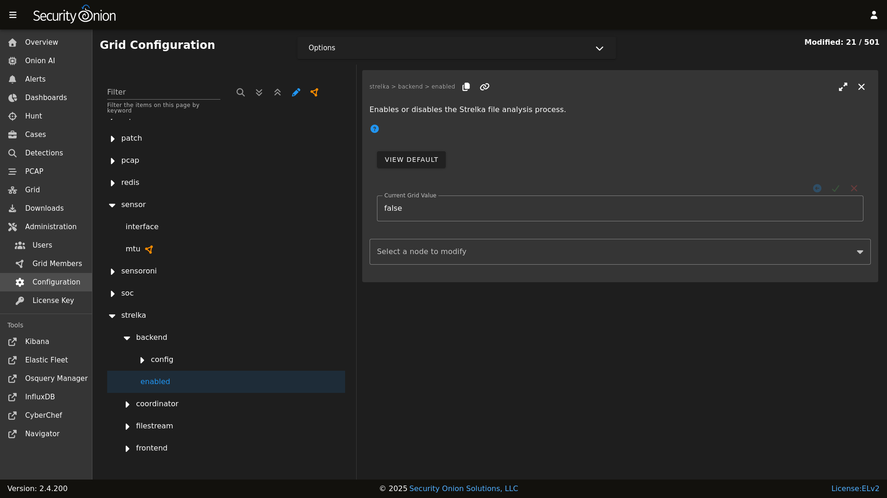

# Strelka

From <https://github.com/target/strelka>:

> Strelka is a real-time file scanning system used for threat hunting, threat detection, and incident response. Based on the design established by Lockheed Martin's Laika BOSS and similar projects (see: related projects), Strelka's purpose is to perform file extraction and metadata collection at huge scale.

If you are monitoring network traffic, then either [Zeek](zeek.md) or [Suricata](suricata.md) should be extracting certain files detected in unencrypted network traffic. Strelka then analyzes those files and they end up in `/nsm/strelka/processed/`.

Security Onion checks file hashes before sending to Strelka to avoid analyzing the same file multiple times in a 48 hour period.

## Alerts

Strelka scans files using [YARA](yara.md) rules. If it detects a match, then it will generate an alert that can be found in [Alerts](alerts.md), [Dashboards](dashboards.md), or [Hunt](hunt.md). You can configure [YARA](yara.md) rules via [Detections](detections.md).

## Logs

Even if Strelka doesn't detect a [YARA](yara.md) match, it will still log metadata about the file. You can find Strelka logs in [Dashboards](dashboards.md) and [Hunt](hunt.md).

## Configuration

You can configure Strelka by going to [Administration](administration.md) --> Configuration --> Strelka.



## Diagnostic Logging

Strelka diagnostic logs are in `/nsm/strelka/log/`. Depending on what you’re looking for, you may also need to look at the [Docker](docker.md) logs for the containers:


```
sudo docker logs so-strelka-backend
sudo docker logs so-strelka-coordinator
sudo docker logs so-strelka-filestream
sudo docker logs so-strelka-frontend
sudo docker logs so-strelka-manager
```

## More Information

!!! NOTE
    
    For more information about Strelka, please see <https://github.com/target/strelka>.